# 东宝商城

## 前言

从单体项目到微服务到服务网格的这么一个演化过程

https://gitee.com/cpf100/msb-dongbao-mall

### 意识

意识：

1. 好的技术和架构都是演化来的。杜绝过度设计。
2. 功能先有后优。
3. 好的设计图，架构图，业务逻辑图，时序图等，充满美感
4. 好多牛X的人，都是不断发现自己是傻X的过程。不知道自己不知道，才可怕。
5. 有问题自己先思考再问。（自己没有答案之前不要问）
6. 依赖了别人就是放弃了自己

### 一个项目的流程

企业中怎么做项目？你要去企业中做一个项目，首先是有一个叫产品经理的角色给你需求。但就是给你一份一份产品文档，可能是原型图，可能是一个word。对着需求写好设计文档，写代码的时候照着敲就行。记录好自己开发的思路，哪怕简单的画画几个图，不然自己写的代码过了两周自己都看不懂。

需求出来之后有一个项目的启动会，一般在互联网公司中叫Kick Off。小公司开发和测试可能没有并行，但是大一点的都是开发测试并行的。你写后端开发之前肯定要定义好接口，定好了才去开发，然后测试对着你的接口写测试用例。

开发开始了，做设计，设计完了编码，还有一轮评审。测试也写它的TC。然后测试没问题了才发布。

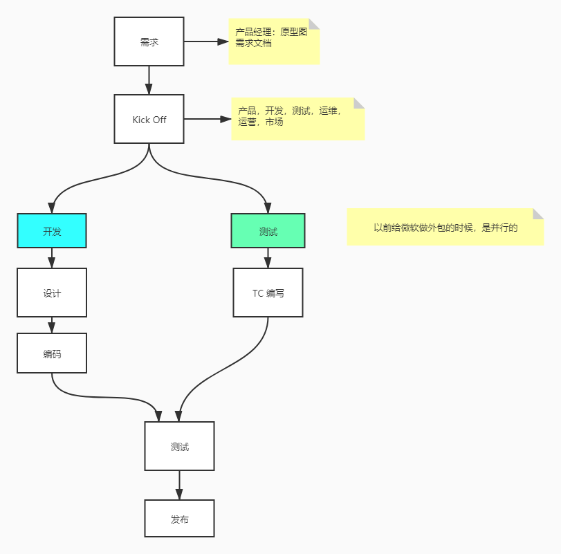

### 规范

开发规范，阿里规约，命名、日志、错误码、数据库建表等等的规定。

### 工程结构

项目结构是用maven的一个聚合工程。父项目下面是子项目

```xml
父项目
----子项目
----子项目

pom.xml
```

父项目一般以parent结尾。下面有很多子项目，应用入口、接口、实现、工具。

```xml
wcx-dongbao-mall-parent        	父项目
--wcx-dongbao-mall-application 	入口（controller）
--wcx-dongbao-mall-api			接口（controller调用api）
	--wcx-dongbao-cms-api
	--wcx-dongbao-cart-api		购物车api代码
    --wcx-dongbao-pms-api		商品中心api代码
	--wcx-dongbao-dictionary-api
	--wcx-dongbao-oms-api
	--wcx-dongbao-pay-api
	--wcx-dongbao-sms-api
	--wcx-dongbao-ums-api

--wcx-dongbao-mall-service		接口的实现层(api的实现层)
	--xxxx项目
--wcx-dongbao-mall-common		通用工具类

pom.xml
```

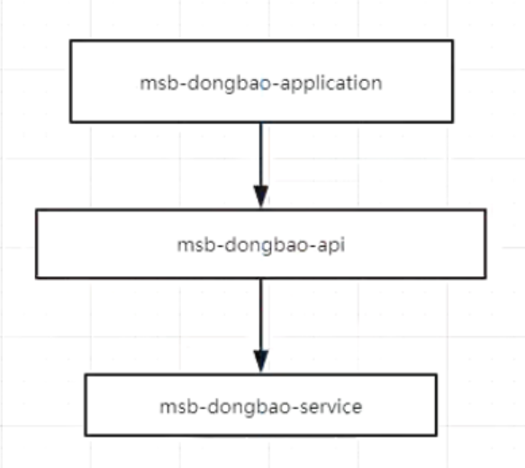

创建一个maven项目，写好groupID，看下面规范。

```
1.【强制】定义 GAV 遵从以下规则：
1） GroupID 格式：com.{公司/BU }.业务线 [.子业务线]，最多 4 级。
说明：{公司/BU} 例如：alibaba/taobao/tmall/aliexpress 等 BU 一级；子业务线可选。
正例：com.taobao.jstorm 或 com.alibaba.dubbo.register
```

| 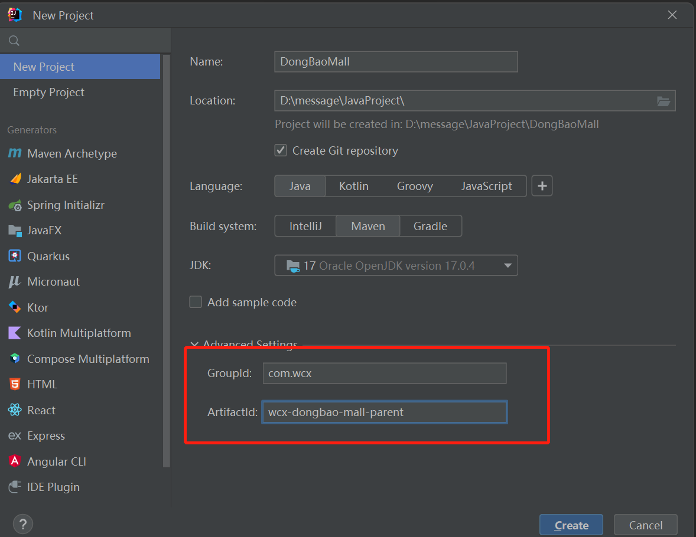 |      |
| ------------------------------------------------------------ | ---- |

进来之后pom文件中，由于是父项目，不打成jar或者war。我们这里写pom。

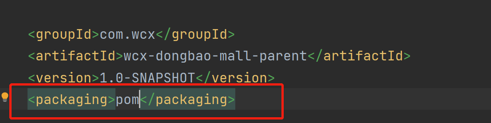

然后去创建这个父项目的子项目。父项目通过modules标签来管理它下面的所有的模块，要作为父的模块，就在下面打标签，当然这里帮你打了。

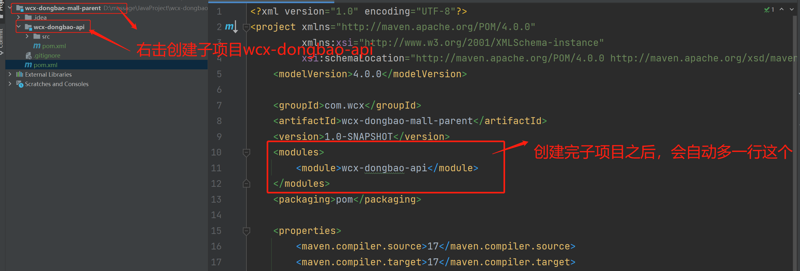

按照下面，把所有的项目的骨架搭建好。父项目的子项目可能还有子项目，就在里面继续创建module即可。分了三层。

`wcx-dongbao-oms-api`就是一个jar，它会编译成一个jar包，让别的模块来引用。也就是`wcx-dongbao-oms-api`编译之后会变成`wcx-dongbao-oms-api.jar`，别的项目A要用就在A项目的pom文件中写上`wcx-dongbao-oms-api.jar`的坐标，坐标就是`<artifactId> + <GroupId> + <version>`。

一二层都是pom，一二层的模块建起来之后src都要删掉。只有第三层才不删，第三层才是写代码的地方。

建立这么多的module，是为了把模块分开。两个业务模块在两个工程中开发会更好的协作，更能提交的时候减少代码的冲突。以后拆服务、要向微服务进化的时候，模块可以直接独立出去就是一个微服务了。这样的项目重构的话，搞上注册中心，瞬间就变成了微服务了。

注意：子项目需要在pom文件中显式写上 < parent >标签，否则就不能由最根的父项目来统一管理版本了，并且各种各样的配置也不需要在子项目重新写一遍，我们只需要在根项目写一份即可。父项目继承自spring boot项目，然后其它的版本管理交给dependencyManagement。

相应的版本号写到外面properties标签里面，这样方便修改。

根项目的pom文件如下。需要使用的所有依赖都写在根项目的dependencyManagement里。

- 接口最好不用可变参数例如`String ... age 以及 HashMap`，因为你的接口不可控，别人什么都可以传。

- API就是一个service的规范

- maven子项目继承父项目的版本，如果子项目没有指定版本，那么版本会以父项目的为准，如果指定了，那么就会覆盖父项目。同理，配置`<properties>`也是先继承，如果需要子项目也可以覆盖。

  关于maven加速，找到下面这个settings.xml，然后在文件里面取消掉原本的镜像，加上下面的镜像进行加速。localRepository这个标签也可以改一下，这是下载的包存放的位置。

  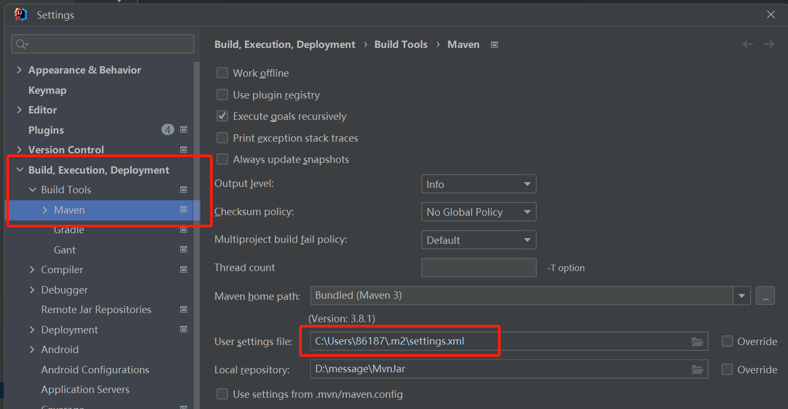

  在Maven中，中央仓库是默认的仓库，它包含了许多常用的依赖库。当Maven需要从中央仓库下载依赖库的jar包等文件时，就会使用这个配置定义的镜像地址进行下载，加快下载速度。

  因此，这个配置项`<mirrorOf>central</mirrorOf>`的作用就是将所有对中央仓库的请求都转发到该镜像地址。中央仓库是默认，下面的仓库是补充，如果中央仓库找不到就会去下面找。

  ```
  	 <localRepository>D:\message\MvnJar</localRepository>
  	  
  	 <mirror> 
        <id>alimaven</id>
        <name>aliyun maven</name>
  	  <url>https://maven.aliyun.com/repository/public</url>
        <mirrorOf>central</mirrorOf>     //中央仓库   
      </mirror>	  
      //下面仓库作为补充
  	<mirror>
       <id>aliyunmaven</id>
       <mirrorOf>*</mirrorOf>
       <name>阿里云公共仓库</name>
       <url>https://maven.aliyun.com/repository/public</url>
      </mirror>
       <mirror>
       <id>aliyunmaven</id>
       <mirrorOf>*</mirrorOf>
       <name>阿里云谷歌仓库</name>
       <url>https://maven.aliyun.com/repository/google</url>
      </mirror>
      <mirror>
       <id>aliyunmaven</id>
       <mirrorOf>*</mirrorOf>
       <name>阿里云阿帕奇仓库</name>
       <url>https://maven.aliyun.com/repository/apache-snapshots</url>
      </mirror>
      <mirror>
       <id>aliyunmaven</id>
       <mirrorOf>*</mirrorOf>
       <name>阿里云spring仓库</name>
       <url>https://maven.aliyun.com/repository/spring</url>
      </mirror>
      <mirror>
       <id>aliyunmaven</id>
       <mirrorOf>*</mirrorOf>
       <name>阿里云spring插件仓库</name>
       <url>https://maven.aliyun.com/repository/spring-plugin</url>
      </mirror>
  ```

- maven的另一个好处是一个项目下可以加入工程，也就是模块。并且不需要自己拷贝jar包到lib里面，maven会帮我们自动导入。

- common层里面是一些基础的工具类，比如说有统一封装返回值的一个类。一般的接口的返回值是这样子的，基础common层里封装的就是下面这些，因为这些是每个接口都需要的。

  ```
  {
  	code:1
  	msg:success
  	data:{}
  }
  ```

  

```
代码模块介绍
wcx-dongbao-mall-parent        	父项目
	wcx-dongbao-common 公共包
		wcx-dongbao-common-base 公共基础类
		wcx-dongbao-common-util 工具类，日期转格式、时间转格式等等
	wcx-dongbao-api 业务模块接口层，里面全都是接口，下面的子工程里面定义的全都是interface
		wcx-dongbao-oms-api 订单中心接口
		wcx-dongbao-pms-api 商品中心接口
		wcx-dongbao-ums-api 用户中心接口
		wcx-dongbao-pay-api 支付中心接口
		wcx-dongbao-cart-api 购物车接口
		wcx-dongbao-dictionary-api 基础字典接口
		wcx-dongbao-sms-api 优惠中心接口
		wcx-dongbao-cms-api 内容中心接口
	wcx-dongbao-service 业务模块实现层，是上面api接口层的具体实现。
		wcx-dongbao-oms 订单中心模块实现
		wcx-dongbao-pms 商品中心模块实现
		wcx-dongbao-ums 用户中心模块实现
		wcx-dongbao-pay 支付中心模块实现
		wcx-dongbao-cart 购物车模块实现
		wcx-dongbao-dictionary 基础字典模块实现
		wcx-dongbao-sms 优惠中心模块实现
		wcx-dongbao-cms 内容中心模块实现
	wcx-dongbao-application 是web应用模块，应用的入口-Controller，接住用户的http请求
	    wcx-dongbao-manager-web 后台管理应用
		wcx-dongbao-portal-web 商城门户网站，是外面来调用我们项目的入口
	wcx-dongbao-job 定时任务模块
	wcx-dongbao-generator 代码生成器，MyBatis Plus
```

直接在父项目里面打一个`<modules>`标签，然后在里面直接写上所有需要的模块，然后按`ALT+ENTER`让maven帮你创建，配合`CTRL+ALT+(左 右)`快速返回。

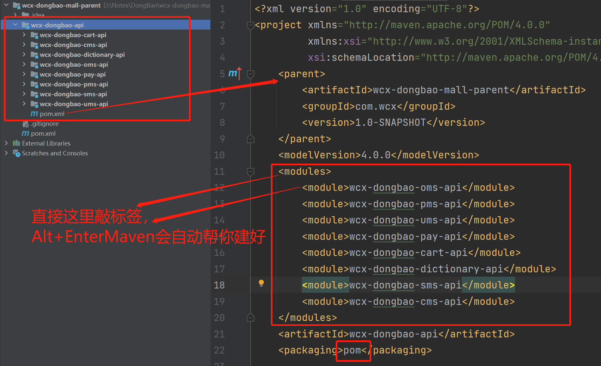

### 装好数据库

1. 去官网：[MySQL :: Download MySQL Community Server](https://dev.mysql.com/downloads/mysql/)

2. 选择linux通用版本：Linux-Gernic，glibc，x86 - 64bit 。

3. 可以在windows下载完用FTP传上去，也可以用wget命令下载，安装到 /usr/local 目录下，解压

```bash
tar -Jxvf 可以解压tar.xz后缀的压缩文件
tar -zxvf 可以解压tar.gz后缀的压缩文件
tar -xvf 可以根据默认后缀帮你决定使用哪种格式进行解压，不知道的时候就用这个

在Linux中，tar命令默认使用gzip进行压缩和解压缩操作，因为gzip是最常见的压缩格式之一。但是使用的tar包是使用xz格式进行压缩的，那么tar命令将自动使用xz进行解压缩。
```

4. 解压完了之后进入到目录里面创建data目录。看你要不要创建mysql组，然后更改权限

```bash
groupadd mysql
useradd -g mysql root
chown -R mysql.mysql '安装目录全路径'
```

5. 创建/etc/my.cnf

```bash
[mysqld]
user=root  以root的身份启动mysql服务器
#user=mysql  觉得root启动权利太大了，可以用mysql的身份启动
datadir=/usr/local/mysql/mysql-8.0.30-el7-x86_64/data/  数据防止的目录
basedir=/usr/local/mysql/mysql-8.0.30-el7-x86_64/    安装目录
port=3306  服务器监听的端口
max_connections=200 最大并发连接数
max_connect_errors=10 在尝试连接到MySQL服务器时允许的最大错误数
character-set-server=utf8 默认字符集
default-storage-engine=INNODB 默认存储引擎
default_authentication_plugin=mysql_native_password 指定MySQL服务器使用的默认身份验证插件
lower_case_table_names=1 指定MySQL服务器在创建和查询表时是否将表名转换为小写
group_concat_max_len=102400 指定MySQL服务器允许的最大GROUP_CONCAT()函数返回值的长度
wait_timeout=86400 指定MySQL服务器在等待客户端活动超时之前的最大时间（以秒为单位）
bind-address=0.0.0.0 允许远程
#skip-ssl

[mysql]
default-character-set=utf8

[client]
port=3306  //作为客户端的时候，没有指定去那个端口访问时候的默认访问端口。
default-character-set=utf8
```

5. 进入到bin目录，开始初始化

```bash
.\mysqld --defaults-file="/etc/my.cnf" --initialize --console

--initialize：初始化data目录，数据，密码
--console 打印出来
--defaults-file 指定配置文件路径
```

6. 添加到Linux服务

```
vim /etc/systemd/system/mysql.service
```

加入以下内容

```bash
[Unit]
Description=mysql

[Service]
ExecStart=/usr/local/mysql/mysql-8.0.30-el7-x86_64/bin/mysqld --defaults-file=/etc/my.cnf
ExecStop=/usr/local/mysql/mysql-8.0.30-el7-x86_64/support-files/mysql.server stop
Type=simple

[Install]
WantedBy=multi-user.target
```

刷新，启动！

```bash
systemctl daemon-reload
systemctl start myslq
systemctl status myslq
//systemctl stop myslq
```

7. 登录，改密码，改远程连接的主机为%。

```
mysql -u root -h localhost -p
*****输入密码
ALTER USER 'root'@'localhost' IDENTIFIED WITH mysql_native_password BY 'YYcx2928999.';
use mysql;
update user set host='%' where user='root';
flush privileges;
quit;
```

8. 云服务器开放端口3306


### 创建数据库

根据前端看看开发需要一些什么东西。短信运营商提供的是API。

| 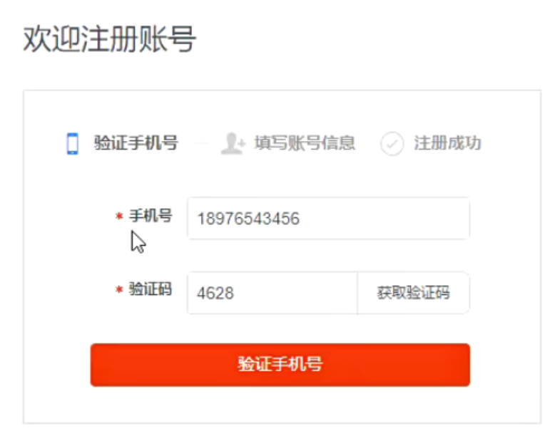 | 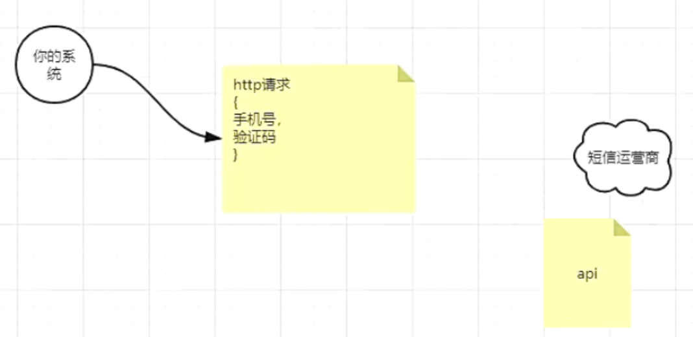 |
| ------------------------------------------------------------ | ------------------------------------------------------------ |
| 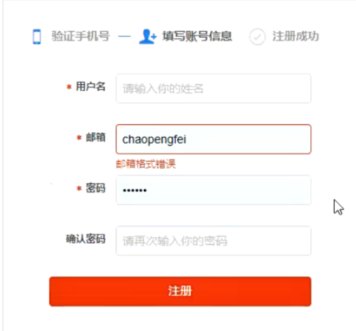 |                                                              |

几个字段：用户名，邮箱，密码。**根据这些设计字段，去建表，看建表规约！**

- 规约里面规定了下面很多的东西，例如要有id、gmt_create、gmt_modified。并且更新时间不要交给数据库去自动设置，一定由程序来控制。

该表的主键是 `id` 字段，使用了自增的方式生成每个记录的唯一标识。同时，该表还定义了一个唯一索引，索引名为 `un_name`，作用在 `username` 字段上，使用了 B-TREE 索引算法，保证了 `username` 字段的唯一性，避免了重复的记录。最后，该表使用了 InnoDB 存储引擎，并设置了自增起始值为 61，字符集为 utf8，注释为“后台用户表”。

```SQL
CREATE TABLE `ums_member` (
  `id` bigint(20) NOT NULL AUTO_INCREMENT,
  `username` varchar(64) DEFAULT NULL,
  `password` varchar(64) DEFAULT NULL,
  `icon` varchar(500) DEFAULT NULL COMMENT '头像',
  `email` varchar(100) DEFAULT NULL COMMENT '邮箱',
  `nick_name` varchar(200) DEFAULT NULL COMMENT '昵称',
  `note` varchar(500) DEFAULT NULL COMMENT '备注信息',
  `gmt_create` datetime DEFAULT NULL COMMENT '创建时间',
  `gmt_modified` datetime DEFAULT NULL COMMENT '修改时间',
  `login_time` datetime DEFAULT NULL COMMENT '最后登录时间',
  `status` int(1) DEFAULT '1' COMMENT '帐号启用状态：0->禁用；1->启用',
  PRIMARY KEY (`id`),
  UNIQUE KEY `un_name` (`username`) USING BTREE COMMENT '用户名唯一'
) ENGINE=InnoDB AUTO_INCREMENT=61 DEFAULT CHARSET=utf8 COMMENT='后台用户表';
```

```
当设计关系型数据库时，我们需要考虑如何组织数据以便于查询和维护。范式（Normalization）就是一种常用的设计数据库的方法，目的是消除冗余数据，使数据库更加简洁、规范和高效。下面是对第一范式、第二范式、第三范式和 BC 范式的直白简单的解释：

第一范式（1NF）：要求数据库中的每个属性都是原子性的，即每个属性不可再分解。例如，如果一个学生表包含一个名字字段和一个地址字段，而地址字段包含了多个子属性（如街道、城市、省份等），那么这个表就不符合第一范式。

第二范式（2NF）：要求数据库中的每个非主键属性都完全依赖于主键，而不是仅依赖于主键的部分属性。例如，如果一个订单表包含订单号、商品编号、商品名称和商品单价等属性，那么商品名称和商品单价就不符合第二范式，因为它们仅依赖于商品编号，而不是订单号和商品编号的组合。

第三范式（3NF）：要求数据库中的每个非主键属性都不依赖于其他非主键属性，即不存在传递依赖关系。例如，如果一个部门表包含部门编号、部门名称和部门负责人等属性，其中部门负责人又包含多个子属性（如姓名、电话、邮箱等），那么这个表就不符合第三范式，因为部门负责人的姓名、电话和邮箱等属性都依赖于部门负责人这个属性，而不是部门编号或部门名称。

BC 范式：BC 范式是基于多值依赖的范式，要求数据库中的每个属性都完全依赖于主键，而不是仅依赖于主键的某一部分。这个范式比第三范式更加严格，可以进一步消除冗余数据，提高数据库的性能和可维护性。但是，实际上很少有数据库设计达到 BC 范式，因为它要求的条件比较苛刻，且设计成本较高。

总之，范式是一种规范化的数据库设计方法，可以提高数据库的可靠性、可维护性和性能。但是，应该根据具体的应用场景和需求来选择合适的范式，并且在设计时需权衡范式要求和实际情况之间的差异。
```

```
UNIQUE KEY `un_name` (`username`) USING BTREE COMMENT '用户名唯一'

这是一段 MySQL 数据库表定义语句中的一个索引定义语句，它定义了一个名为 un_name 的唯一索引，该索引作用在 username 字段上，使用了 B-TREE 索引算法，同时添加了注释说明“用户名唯一”。

唯一索引是一种索引类型，它要求表中对应字段的值必须唯一，即不能重复，这可以保证数据库表中不会出现重复数据。在这个例子中，un_name 索引作用在 username 字段上，因此数据库会自动检查 username 字段的值是否唯一，如果不唯一，则会抛出异常，避免插入重复数据。

B-TREE 索引是一种常见的索引算法，它将数据存储在一棵 B-TREE 数据结构中，可以高效地支持范围查询和排序操作。在这个例子中，使用 B-TREE 索引算法可以提高 username 字段的查询效率，加快数据库的响应速度。

注释是可选的，可以用来说明索引的作用和用途，便于开发人员理解和维护数据库。在这个例子中，注释说明了这个索引的作用是保证 username 字段的唯一性。
```

### 写简单代码

现在表创建好了，移步到generator模块。先导入一些依赖。

- 使用了lombok需要在idea装插件，在插件里面搜lombok。并且下面的lombok的scope没有加，应该是provided，也就是在编译的测试阶段生效。运行阶段已经都生成好代码了，lombok就是用来干这事的，简化你的开发。
- mybatis-plus-generator用来生成代码。但是需要模板引擎velocity，要一起导入。

注意，需要的mybatis、mybatis-plus需要的依赖都导入带有springboot-starter的，不要导成原始的。

### 代码生成器

Mybatis-plus

GlobalConfig 的常用配置

```java
setOutputDir(String outputDir): 设置代码生成的输出目录。
setAuthor(String author): 设置代码生成的作者信息。
setFileOverride(boolean fileOverride): 设置是否覆盖已存在的文件。
setActiveRecord(boolean activeRecord): 设置是否开启 ActiveRecord 模式。
setEnableCache(boolean enableCache): 设置是否启用二级缓存。
setBaseResultMap(boolean baseResultMap): 设置是否生成基本的 ResultMap。
setBaseColumnList(boolean baseColumnList): 设置是否生成基本的 SQL 片段，包括表的所有字段。
setDateType(DateType dateType): 设置生成的实体类中日期类型的处理方式，例如仅使用 Date、LocalDateTime 等。
setSwagger2(boolean swagger2): 设置是否生成 Swagger2 注解。
setDbConfig(DbConfig dbConfig): 设置数据库配置信息，如数据库类型、驱动类、URL、用户名、密码等。
setMetaObjectHandler(MetaObjectHandler metaObjectHandler): 设置自定义的元对象处理器，用于自动填充字段值。
setSqlInjector(SqlInjector sqlInjector): 设置自定义的 SQL 注入器。
setSqlSessionFactory(SqlSessionFactory sqlSessionFactory): 设置自定义的 SqlSessionFactory。
setSqlSessionTemplate(SqlSessionTemplate sqlSessionTemplate): 设置自定义的 SqlSessionTemplate。
```

生成完毕之后到Test里面验证一下。


## 用户

### 注册&登录

关于用户字段的时间：gmt_create  gmt_modified ，不用让数据库自动去填，这两个字段要用代码控制。

在config目录中写一个Handler，实现MetaObjectHandler，以及需要在Entity中加上TableField注解即可。用Mybatis-Plus帮我们实现。因为谁用都是这么写，所以我们把这两个字段抽出去。

```
更新的原理。也就是有设置这个字段我才更新，没有设置的我保持不动
<if 某个自段!=null>
某个字段= #{字段的值}
</if>
```

```JAVA
@Component
public class MyHandler implements MetaObjectHandler
{
    @Override
    public void insertFill(MetaObject metaObject) {
        //当代码在执行插入的时候Mybatis-plus会帮你自动生成gmtCreate、gmtModified这两个字段的数据。
        System.out.println("增加插入时间");
        this.setFieldValByName("gmtCreate",new Date(),metaObject);
        this.setFieldValByName("gmtModified",new Date(),metaObject);
    }

    @Override
    public void updateFill(MetaObject metaObject) {
        //当代码在执行更新的时候Mybatis-plus会帮你自动生成gmtModified这个字段的数据。
        System.out.println("增加更新时间");
        this.setFieldValByName("gmtModified",new Date(),metaObject);
    }
}
```

```JAVA
	@TableField(fill= FieldFill.INSERT)
    private Date gmtCreate;

    @TableField(fill= FieldFill.INSERT_UPDATE)
    private Date gmtModified;
```

开始写API，我们service里面要实现的接口都来自于我们`wcx-dongbao-api`项目，service只写实现，所以wcx-dongbao-ums里面的entity、接口都需要移动到wcx-dongbao-ums-api里。

```
移动entity、接口到wcx-dongbao-ums-api项目里面，导入对应的依赖，例如lombok、mubatis-plus。
接着在wcx-dongbao-ums导入wcx-dongbao-ums-api的依赖，因为在service项目里面实现接口，然后把原本报错的地方路径例如xml里面的路径、yml配置文件的路径改对，路径照着wcx-dongbao-ums-api里面的路径写。
```

然后到wcx-dongbao-portal-web项目里面写controller，需要web以及service、service-api的依赖，项目的入口就在这里。

controller -> service ->dao，这是三个的调用关系。现在controller 的web启动没问题了，所以开始搞定service，写完Service之后，在wcx-dongbao-portal-web引入Service的依赖。

模块拆多了，在wcx-dongbao-portal-web的项目入口需要加上注解，才能找到对应Service接口以及实现。

```
@SpringBootApplication(scanBasePackages = {"com.wcx"})
不写这句的话，只会扫描它当前层级的这些类
```

- 做一个新功能，先参考，再优化。

我们还需要给前端专门写一个bean，因为和数据库打交道的是我们的Entity，这些不能和前端打交道的bean混淆了！

这个专门的bean的名字叫做data transfer object，简称dto。

我们在api模块中的entity里面再建一个包，叫做dto。

然后在controller的接口上打上注解，把请求体的参数打包到我们的dto中。

然后传入我们的service。改接口，改实现。


| 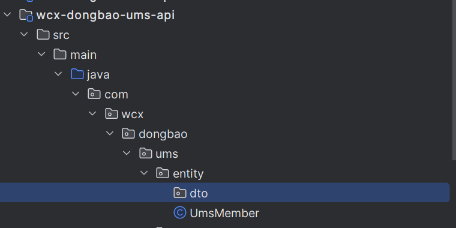 | 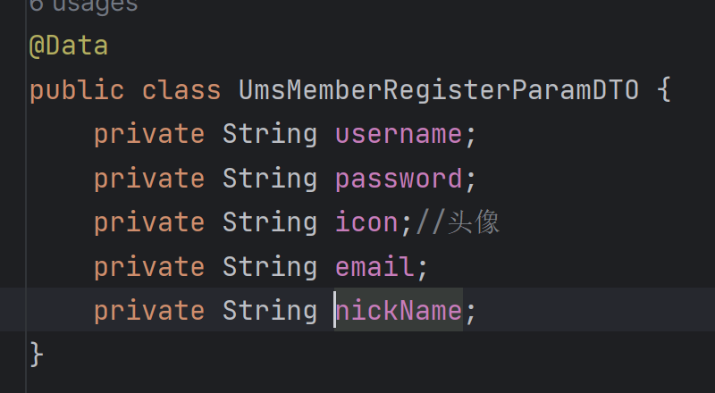 |
| ------------------------------------------------------------ | ------------------------------------------------------------ |
| 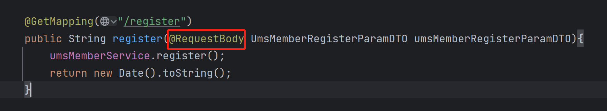 |                                                              |
| 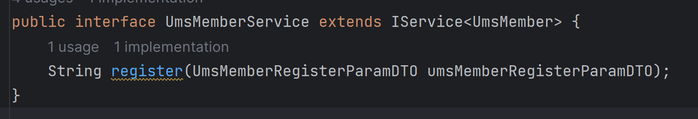 |                                                              |
| 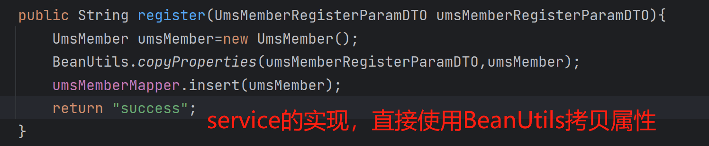 |                                                              |

```
B)领域模型命名规约
1） 数据对象：xxxDO，xxx 即为数据表名。
2） 数据传输对象：xxxDTO，xxx 为业务领域相关的名称。
3） 展示对象：xxxVO，xxx 一般为网页名称。
4） POJO 是 DO/DTO/BO/VO 的统称，禁止命名成 xxxPOJO。
解释：领域模型是一个分析模型，帮助系统分析人员、用户认识现实业务的工具，描述的是业务中涉及到的实体及其相互之间的关系，它是需求分析的产物，与问题域相关。
DO（ Data Object）：与数据库表结构一一对应，通过DAO层向上传输数据源对象。
DTO（ Data Transfer Object）：数据传输对象，Service或Manager向外传输的对象。
BO（ Business Object）：业务对象。 由Service层输出的封装业务逻辑的对象。
VO（ View Object）：显示层对象，通常是Web向模板渲染引擎层传输的对象。
```

#### 用户名不重复

方法，先去查询，确认没有之后才插入。

- 注意xml里面的namespace是`<mapper namespace="com.wcx.dongbao.dao.UmsMemberMapper">`，里面写的是对应接口的全路径。

- 并且要注意：

  1. mybatis以及mybatis-plus的配置中有把xml文件的路径配置进去。

     ```
     mybatis:
       mapper-locations: classpath:com/wcx/dongbao/dao/mapper/*.xml
       type-aliases-package: com.wcx.dongbao.ums.entity
       configuration:
         map-underscore-to-camel-case: true
     
     mybatis-plus:
       mapper-locations: classpath:com/wcx/dongbao/dao/mapper/*.xml
       type-aliases-package: com.wcx.dongbao.ums.entity
     ```

  2. 需要在对应项目里面的pom文件中增加build，设置为能把xml也编译进项目中

     ```
         <build>
             <resources>
                 <resource>
                     <directory>src/main/java</directory>
                     <includes>
                         <include>**/*.properties</include>
                         <include>**/*.xml</include>
                     </includes>
                     <filtering>false</filtering>
                 </resource>
             </resources>
         </build>
     ```

  3. xml中写sql的时候，#{xxxx}里面的xxxx对应的是entity里面的字段。外面的紫色的对应的是表里面的字段名。要注意返回类型以及参数类型。返回类型是接口应该返回什么样的数据。参数类型就是接口给你传进来的参数。


| 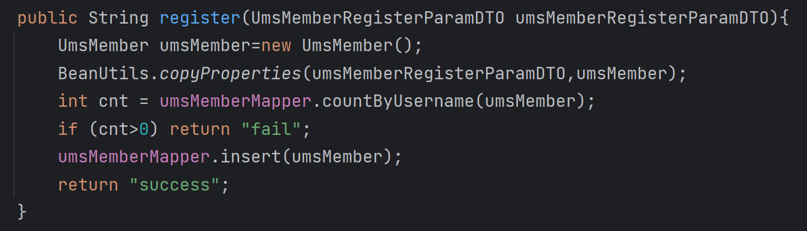 |      |
| ------------------------------------------------------------ | ---- |
| 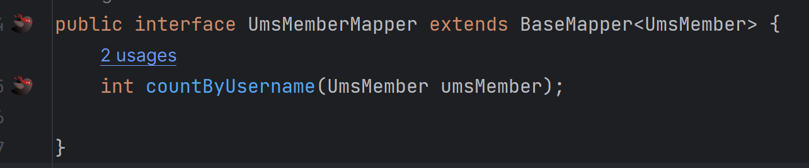 |      |
| 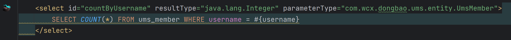 |      |


#### 信息脱敏

密码采用非对称加密，例如md5

手机号以及身份证信息使用对称加密。


#### 统一返回值

```
前后端分离，后端接口，一般：
{
    "code":状态码, 
    "msg":"信息提示",
    "data": T   
    
}
data:object  或者  list
```

101代表用户名错误、102代表密码错误。那么我们需要一个枚举常量。

这样写便于统一管理状态码，也便于前端统一处理。

在common-base模块里面创建枚举以及返回类型。到portal、api、service里面导入依赖之后就能用了。

返回builder是为了方便往里面加data，加了@Builder注解之后，lombok会帮我们生成一个builder。链式调用！

| 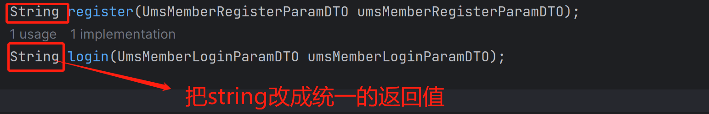                       |      |
| ------------------------------------------------------------ | ---- |
| 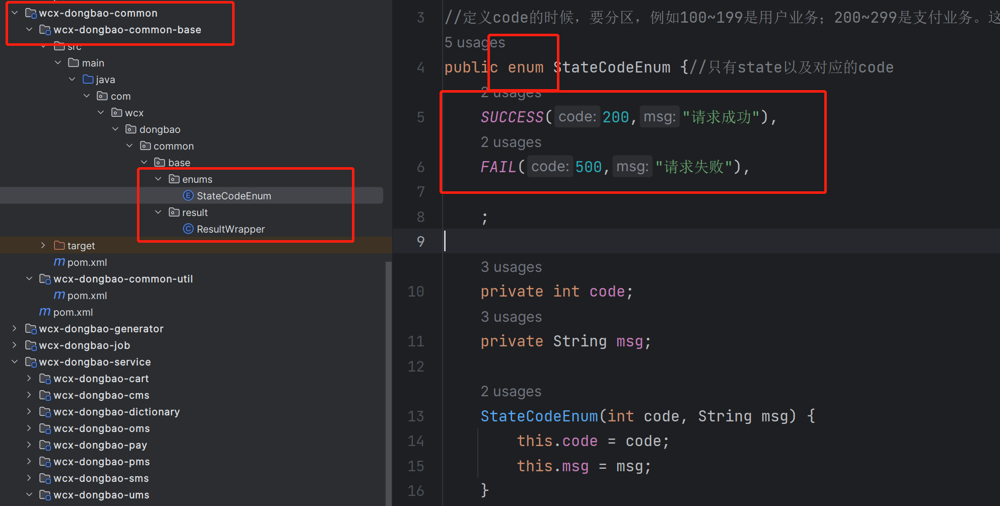 |      |
| 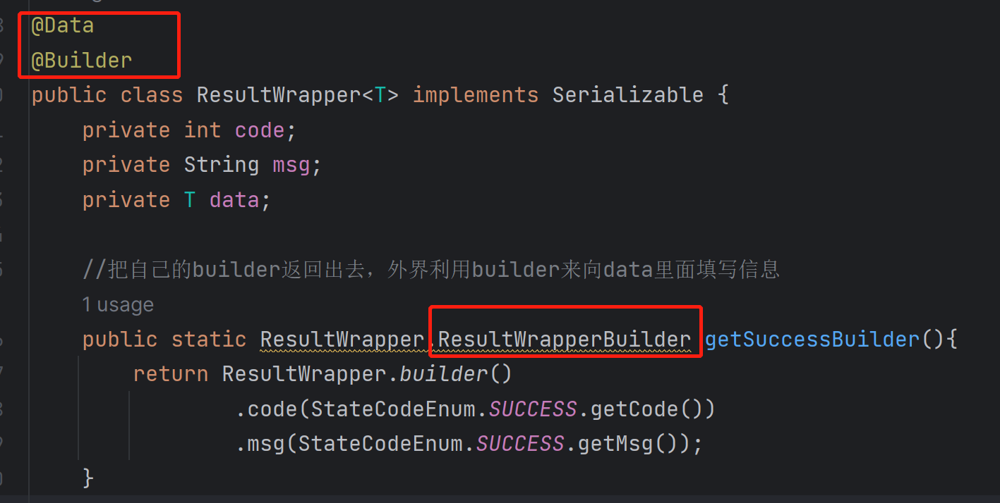 |      |
|                                                              |      |

#### 信息校验+统一异常处理

校验用户名不能超过多少，不能短于多少。前端需要校验，后端也需要校验。

- 需要用到的依赖：注意需要在根项目先添加版本管理。然后在api模块中的dto、以及portal中使用

  ```
         <dependency>
              <groupId>org.springframework.boot</groupId>
              <artifactId>spring-boot-starter-validation</artifactId>
          </dependency>
  ```

下面两步做完了之后，现在请求如果用户名为空，那么就会报错

- 插曲：什么时候用Integer？如果要表达没有钱以及有0元钱的区分，就使用Integer。

| 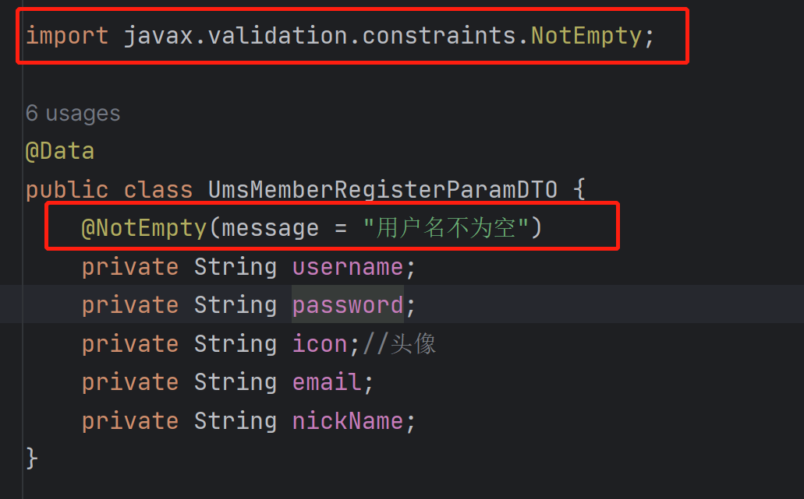 |      |
| ------------------------------------------------------------ | ---- |
| 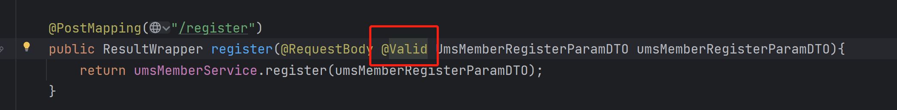 |      |

在portal里面创建advice包，统一异常处理。controller中的异常发生之后都会走到ControllerAdvice里面统一处理。

size包括了NotEmpty。

| 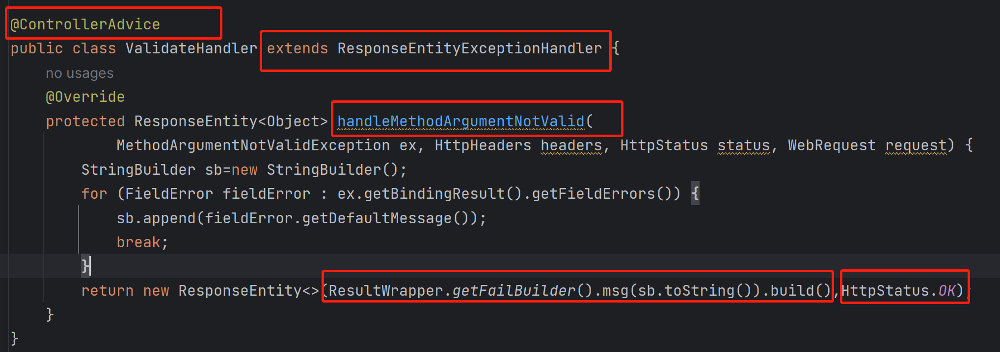 |      |
| ------------------------------------------------------------ | ---- |
| 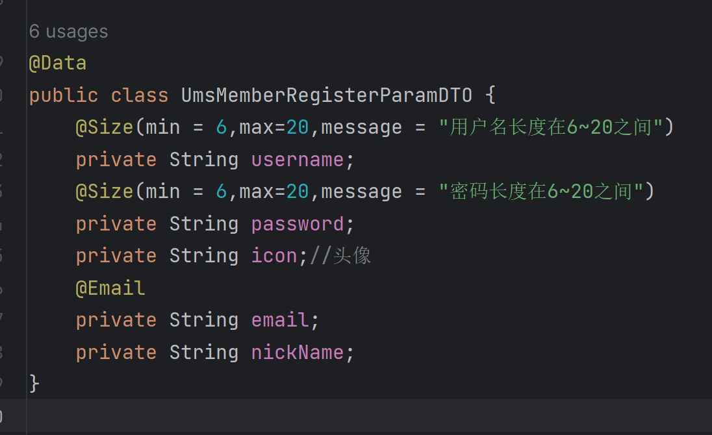 |      |
| 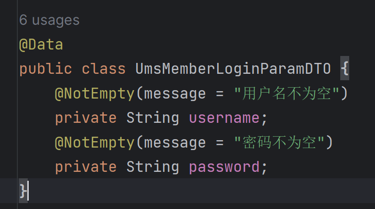 |      |
| 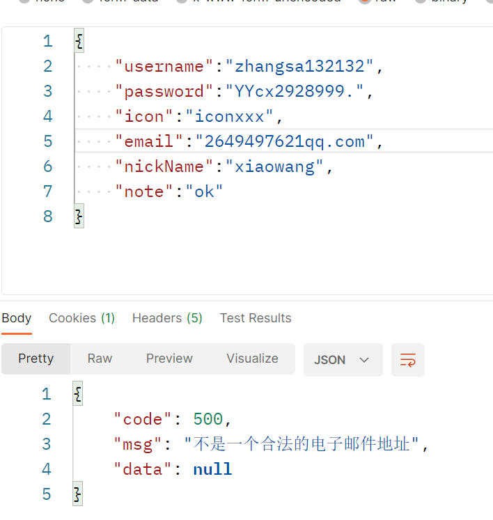 |      |

1. 加validation的依赖。
2. 在controller以及dto加注解
3. 写处理器


#### 项目爆红？

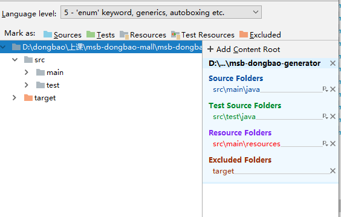


加版本号

刷新maven

<project> 加空格，换行。

.idea删掉，重来。

build

clean package

sources,Resources正确

如果不复杂，你就重新建项目。


#### jwt

登录完了之后要给用户下发令牌。在以后的请求中不需要用户名和密码，只需要这个token就行了。

在之前的单体项目中，后端都是给前端一个sessionid。然后后端需要保存sessionid与用户的映射，这样比较占用内存空间。由于现在后端做成集群了，所以不能简单的把sessionid存在后端了。这时候需要有一个sessionid，把sessionid和用户的映射存在redis里面。但是无论存在哪里，都是需要占用空间的。这种方式的话，请求就是有状态的，也就是你第一次来和第二次来是不一样的。那么这个用户如果因为负载均衡服务器请求到了别的服务器，别的服务器可能不认你，这样不利于水平扩张。

jwt就是你前端第一次请求我后端给你token，你下次再来带着token来，我就知道你是谁了。


在common-util里面写jwt工具类。如何创建token？拿用户的一个主题，比如说就拿你的用户ID来生成。

- 在根pom加入依赖，然后在common-util里面使用

  ```
              <dependency>
                  <groupId>io.jsonwebtoken</groupId>
                  <artifactId>jjwt</artifactId>
                  <version>${jjwt.version}</version>
              </dependency>
  ```

- 使用jdk1.8，不然会报错

- 在util里面写上加密的方法以及解析的方法。

- 可以设置过期时间，如果到了过期时间，那么就不能解析了

用jwt生成的token，别人拿到这个token之后是可以知道你的用户信息的，不需要secret也能知道。解决方案是参数防篡改，涉及到接口安全，后面说。

base64不是加密算法，而是一种编码方式，是可以双向的。

散列-不可逆：md5、sha系列

对称-可逆：使用密钥加密，你也用密钥可以解密。例如DES  3DES  AES

非对称-可逆：公钥加密的东西拿私钥解，私钥加密的东西拿公钥解。例子：我发出的东西希望别人都看得到，那么我用自己的私钥加密发出的东西别人用大家都知道的公钥可以解。但是别人发给我的东西，只能用私钥才行。

```
jwt的组成部分
eyJhbGciOiJIUzI1NiJ9.(base64(header)) header里面声明了一个算法
eyJzdWIiOiJjYWl4aW53YW5nIn0.((base64(payload,载荷,信息-用户名等等))
f1gvpD64rOrche5iQDa5WcoxMwfUxsljgOm89hZ5a6o(签名=SHA256(header+payload,salt(盐-也就是secret))) 使用header里面声明的算法对载荷进行加密，加密参数有一个盐，也就是我们的secret
```

这时候我们封装的包装类就很好用了。

以后登录完之后，所有需要用户鉴权的接口，你都把token带上。

- 小细节：为了使用体验，每次请求完接口都要做token的延期。

  方法1：就是再创建一个token返回回去。但是这样的话老的token还是可以用的，如果你运行这样的情况存在，那么就没有问题。

  方法2：如果你要实时的过期，那么就需要一个redis来辅助，如果用redis，那么你直接给客户一个无限期的token，每次请求完到redis里面去查，如果redis里面还有，那么就在redis里面延时。

  第一种方案牺牲了及时性，换来了存储空间

  第二种方案使用了存储空间，换来了及时性。

  延时可以使用aop去做。

  具体是要延时，多久延时一次。甚至是否延时，都是看业务需求的。

- 场景：如果切换网络就要重新登录怎么办？请求header的时候带上ip地址，token解开发现不会就直接失效。

| 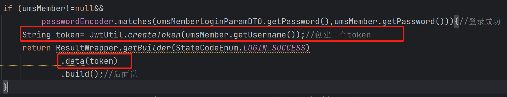 |      |
| ------------------------------------------------------------ | ---- |
| 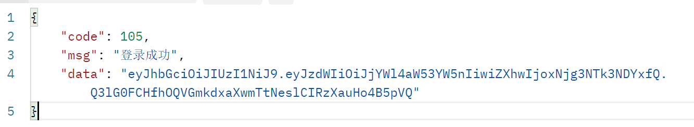 |      |
| 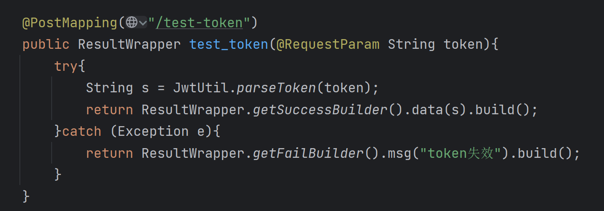 |      |
| 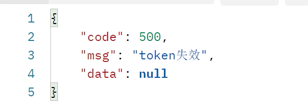 |      |
| 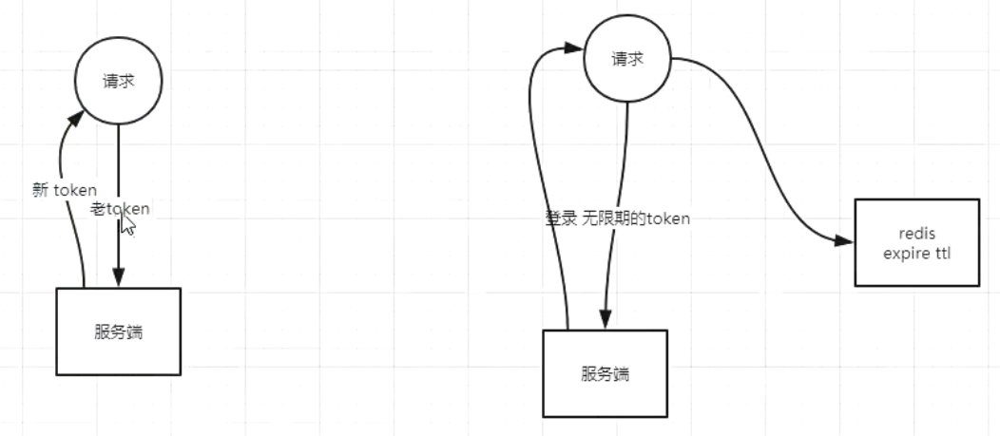 |      |


以后的流程如下。例如调用edit接口的时候，我要先拿到token，然后解析，取出里面的用户名，然后去查这个用户还存不存在。这个流程很固定。所以我们可以用拦截器做。

- 使用注解会让开发变得方便，方便自己也方便别人。在common-base里面写我们的注解。然后在拦截器解析这个注解

1. 在base里面创建我们的注解，在controller加上注解，不要加到service里面了
2. 写拦截器，以及配置类。在portal下面写。
3. 在拦截器里面如果不通过，直接抛出SignatureException异常，到advice里面统一处理，这样返回值会更加规范。

| 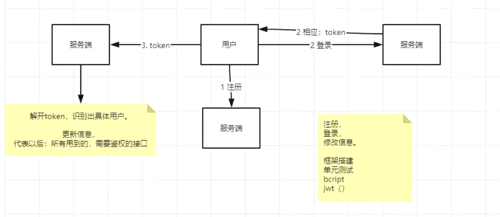 |      |
| ------------------------------------------------------------ | ---- |
| 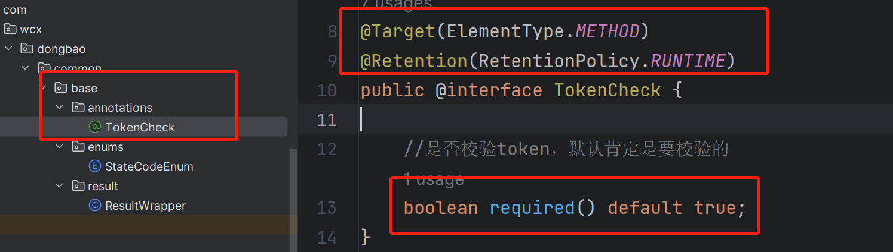 |      |
| 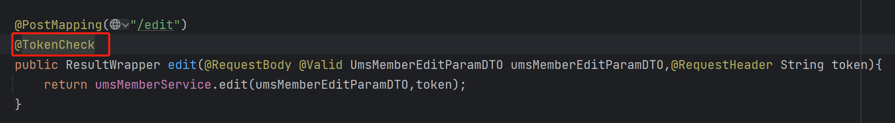 |      |
| 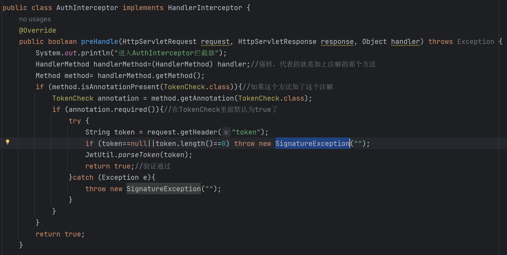 |      |
| 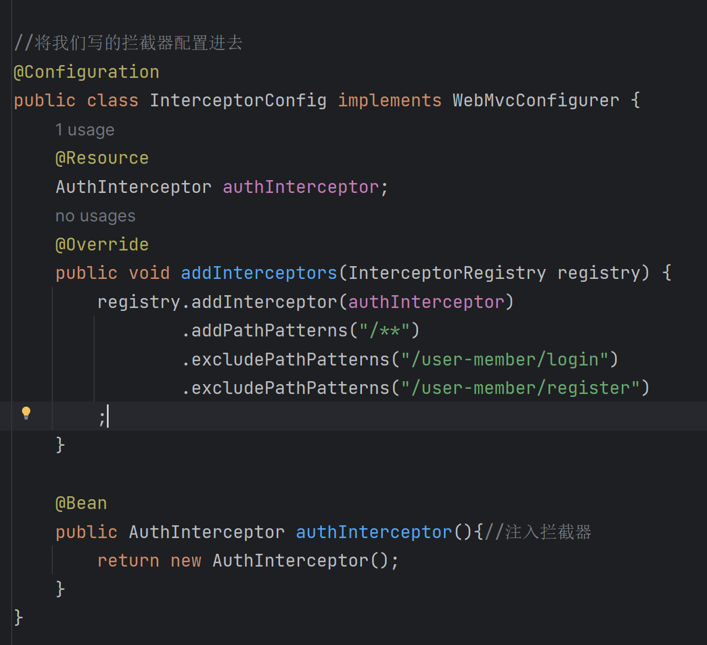 |      |

按照这样的写法，如果在其中一个系统进行单点登录了。拿着这个token去别的系统，只要盐--secret是一样的，都能够认识这个token。

- 这里说的单点登录意思是你在系统A登录了，拿了token，到了系统B不需要重复登录。
- 另外一种单点登录说的是，你在设备A登录了，你到B设备需要重新登录，把A设备给踢掉

继续上面的token续期：

方法3：对于token过期这件事情，除了上面的请求一次就延时，生成一个新的token，还可以利用两个token来完成这个事情，这样可以避免频繁的生成token。为了防止用户登录之后，操作到一半token过期了。我们在返回的时候给用户返回两个token。一个是access_token一个是refresh_token。refresh_token的有效期比较长。当操作到一半的时候发现access_token过期了，就到后端利用refresh_token再去请求一个access_token。

不同公司有不同的做法：

1. 每天第一次请求续期token
2. 每次请求接口续期token
3. access_token与refresh_token 中途续期。如果时间差一小时，那么如果1小时不操作就需要重新登陆
4. access_token新老共存。

- 如果想要过期是实时的，就使用redis。

如何实现A设备登录了，B设备登录可以把A设备顶掉呢？

方法1：redis里面存的key-value是username-token。那么B设备登录只需要把这个token替换了即可。

方法2：一个用户在另一个设备B登录了，系统向A设备推送消息，然后A设备的前端就清掉token。

两种方法的区别就是：方法1是被动的，你动了才知道自己下线了。方法2是主动的，前端直接把你下线了。

| 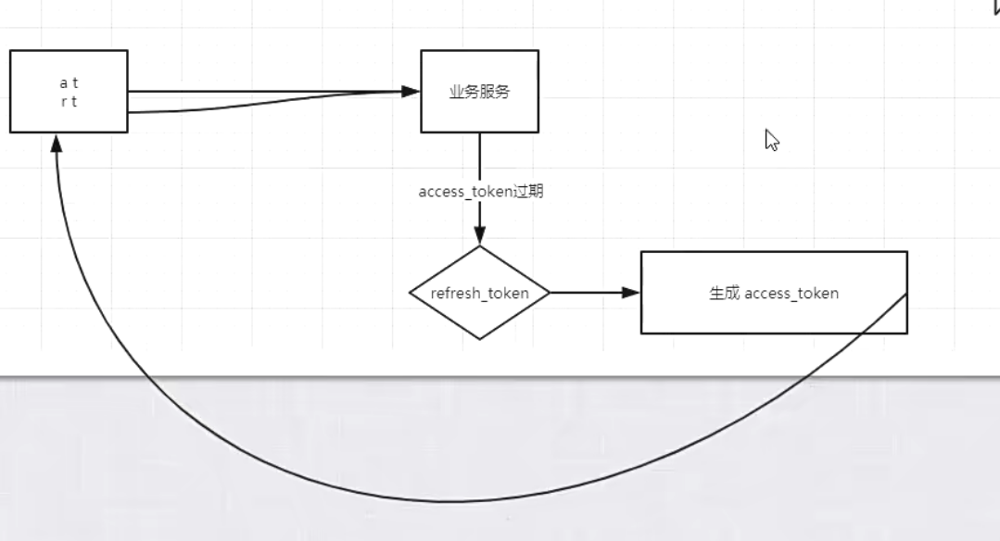 |      |
| ------------------------------------------------------------ | ---- |
| 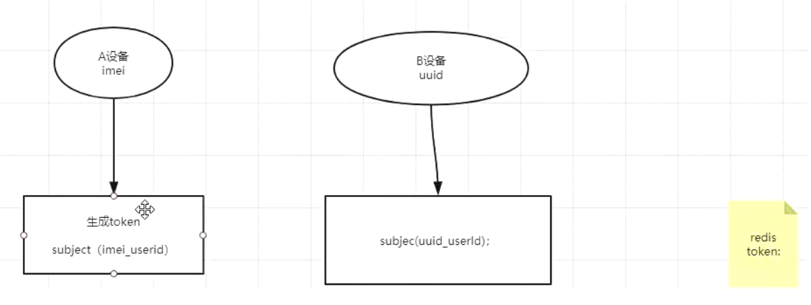 |      |
| 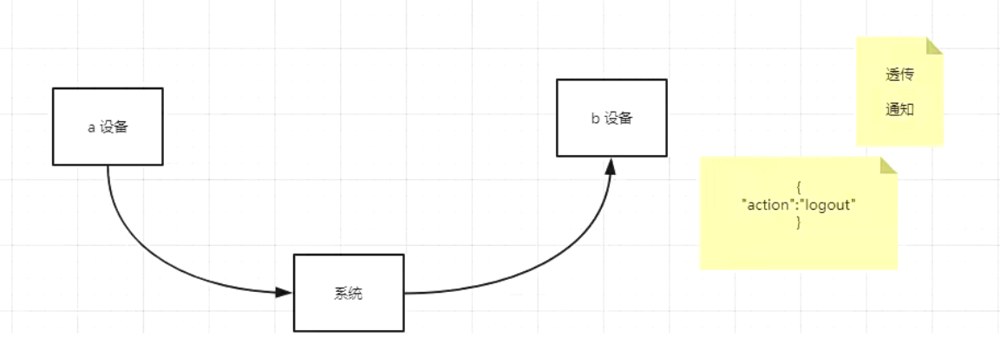 |      |
|                                                              |      |


### 验证码

验证码是为了区分机器和人的图灵测试。

任务：

1. 图形数字验证码
2. 破解掉

#### 手写

- 在util里面写好CodeImage类
- 新建一个controller，使用CodeImage类，向response里面写图片。将验证码存在session中验证。
- 记得将上面的新建的controller的路径排除在我们之前的拦截器之外。
- 比较普通的做法是直接把字节流传给前端浏览器。还有一种做法是使用base64进行编码
- 为什么不传图片地址？因为图片会过期，不是永久存储。
- 好用的网站，base64转图片。`https://tool.jisuapi.com/base642pic.html`


使用jcaptcha来简化。半自动

- 导入依赖：

  ```
              <dependency>
                  <groupId>com.octo.captcha</groupId>
                  <artifactId>jcaptcha</artifactId>
                  <version>${jcaptcha.version}</version>
              </dependency>
  ```

- 创建工具类

- 三要素：框、字、字的形状颜色

- 这个我就不搞了

#### happy-captcha

使用happy-captcha来简化，全自动！

- 导入依赖：

  ```
              <dependency>
                  <groupId>com.ramostear</groupId>
                  <artifactId>Happy-Captcha</artifactId>
                  <version>1.0.1</version>
              </dependency>
  ```

- 直接开controller

- 三两句搞定

- 开源网站:`https://gitee.com/ramostear/Happy-Captcha?_from=gitee_search`

#### easy-captcha

使用easy-captcha。

- 导入依赖：

  ```
          <dependency>
              <groupId>com.github.whvcse</groupId>
              <artifactId>easy-captcha</artifactId>
          </dependency>
  ```

- 新开一个controller

- 还是三两句

- 如果要多台机器，那么就使用redis。导入redis依赖

  ```
          <dependency>
              <groupId>org.springframework.boot</groupId>
              <artifactId>spring-boot-starter-data-redis</artifactId>
          </dependency>
  ```

- redis需要在yaml配置一下地址以及端口。在服务器端要启动起来。

1. 这里的key这里可以写sessionid。因为由于负载均衡，浏览器还是会带着之前的sessionid到负载到的别的服务器。我们做session共享，存到redis里面
2. 这里的key也可以是uuid，然后你把uuid也要传给前端。


| 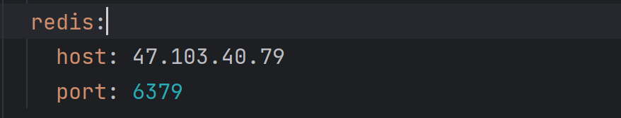 |      |
| ------------------------------------------------------------ | ---- |
| 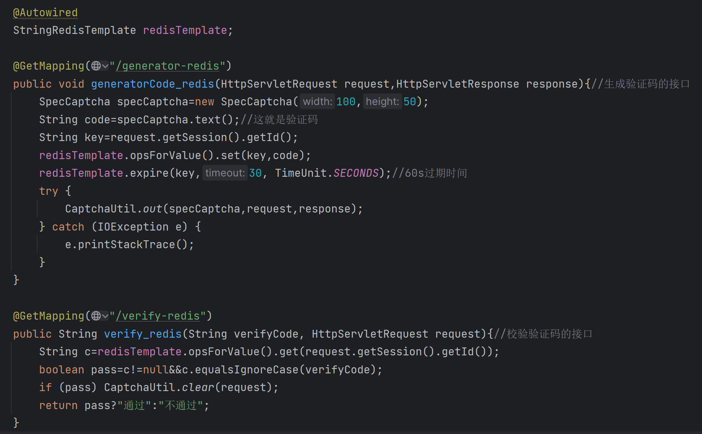 |      |
|                                                              |      |
|                                                              |      |

#### k-captcha

- pom

  ```
              <dependency>
                  <groupId>com.baomidou</groupId>
                  <artifactId>kaptcha-spring-boot-starter</artifactId>
                  <version>1.1.0</version>
              </dependency>
  ```

- 是苞米豆的开源项目：`https://gitee.com/baomidou/kaptcha-spring-boot-starter?_from=gitee_search`

- 找不到某一个类的方法的这种报错，一般都是包冲突。然后就盯着那个报错的包，我们到项目maven里面去一个一个搜，看看到底哪里导重了。然后到pom里面去加入exclude标签。

- k-captture的过期时间的计算方式比较特殊，在生成的时候保留生成的时间点t1，在校验的时间点是t2，根据我们的指定的时间，用t2-t1是否小于等于我们设置的时间来判断，这样我们就不需要在生成的时候设置过期时间，灵活性很高。这样的好处就是什么时候过期由我校验的一方来指定。这样不需要改核心代码，只需要在使用的时候传参即可。

  这样的好处就是将后端要做的事情，交给前端去做，这样就不需要修改后台代码。

  还有一个例子：我们在做短信的时候，如果在后端指定了短信的模板，那么我就只能使用这一个短信的模板。下次我换了一个短信运营商，后端代码需要修改。但是如果把模板这个事情交给了前端给我传，那么我后端的代码就可以减少修改，提高了可拓展性。

  这是一个中间件思维：将业务模板交给客户端去做。

- 点进去源码会发现，kaptcha是通过抛异常来实现校验通不通过的，所以我们可以通过advice来统一处理。

- Ctrl + Alt + B找接口的实现

| 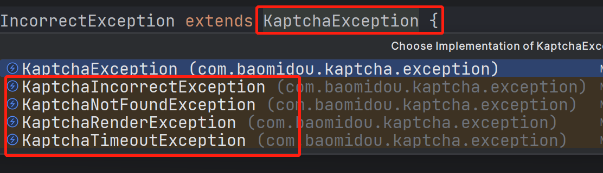 |      |
| ------------------------------------------------------------ | ---- |
| 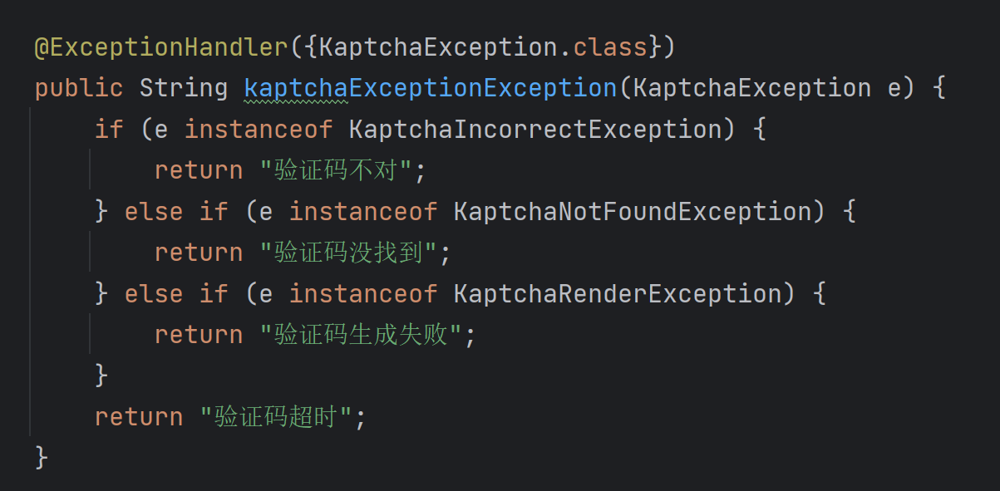 |      |
| 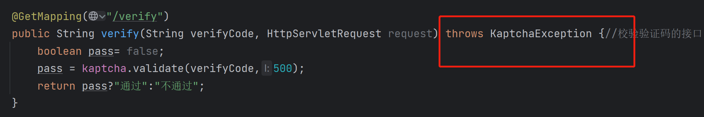 |      |
|                                                              |      |

- 控制宽高，由于是springboot项目。所以直接写在配置文件yaml里面

  ```
  kaptcha:
    height: 50
    width: 200
    content:
      length: 4
      source: abcdefghjklmnopqrstuvwxyz23456789
      space: 2
    font:
      color: black
      name: Arial
      size: 40
    background-color:
      from: lightGray
      to: white
    border:
      enabled: true
      color: black
      thickness: 1
  ```

- 如何使用redis？直接修改源代码。源代码就是直接利用sessionid，存在session里面。我们只要把它获取code以及时间的代码对应改掉即可！！！


| 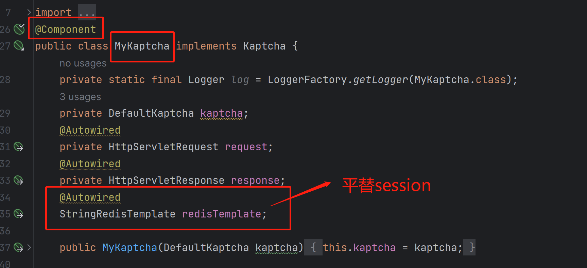 |      |
| ------------------------------------------------------------ | ---- |
| 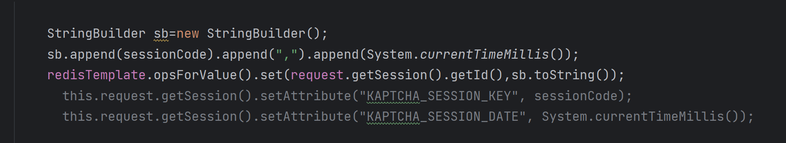 |      |
| 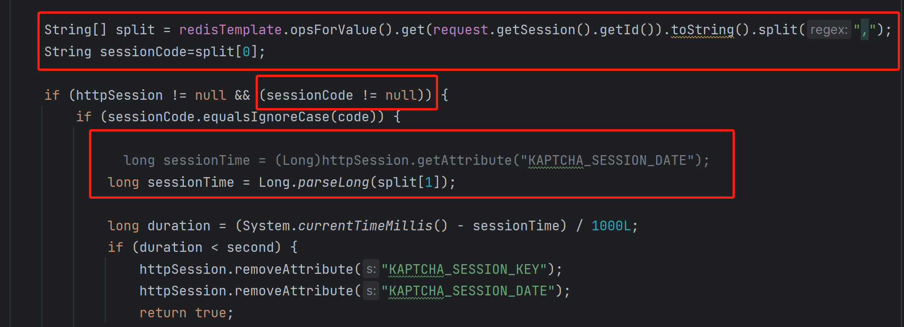 |      |
|                                                              |      |

#### 滑块验证码

本质上就是验证水平方向上的偏移量对不对

- 做法：准备模板，一个是图片，一个是滑块。滑块选择了之后在图片上随机选择一个区域抠图。然后把扣好的图以及滑块用base64编码发给前端。然后前端传输偏移的数据量到后台验证


### 打包

每个模块

```
    <build>
        <plugins>
            <plugin>
                <groupId>org.springframework.boot</groupId>
                <artifactId>spring-boot-maven-plugin</artifactId>
                <configuration>
                    <classifier>exec</classifier>
                </configuration>
            </plugin>
        </plugins>
    </build>
```

parent:   clean   package

web: clean package

class not find （底层jar的类找不到。exec）


## 时序图


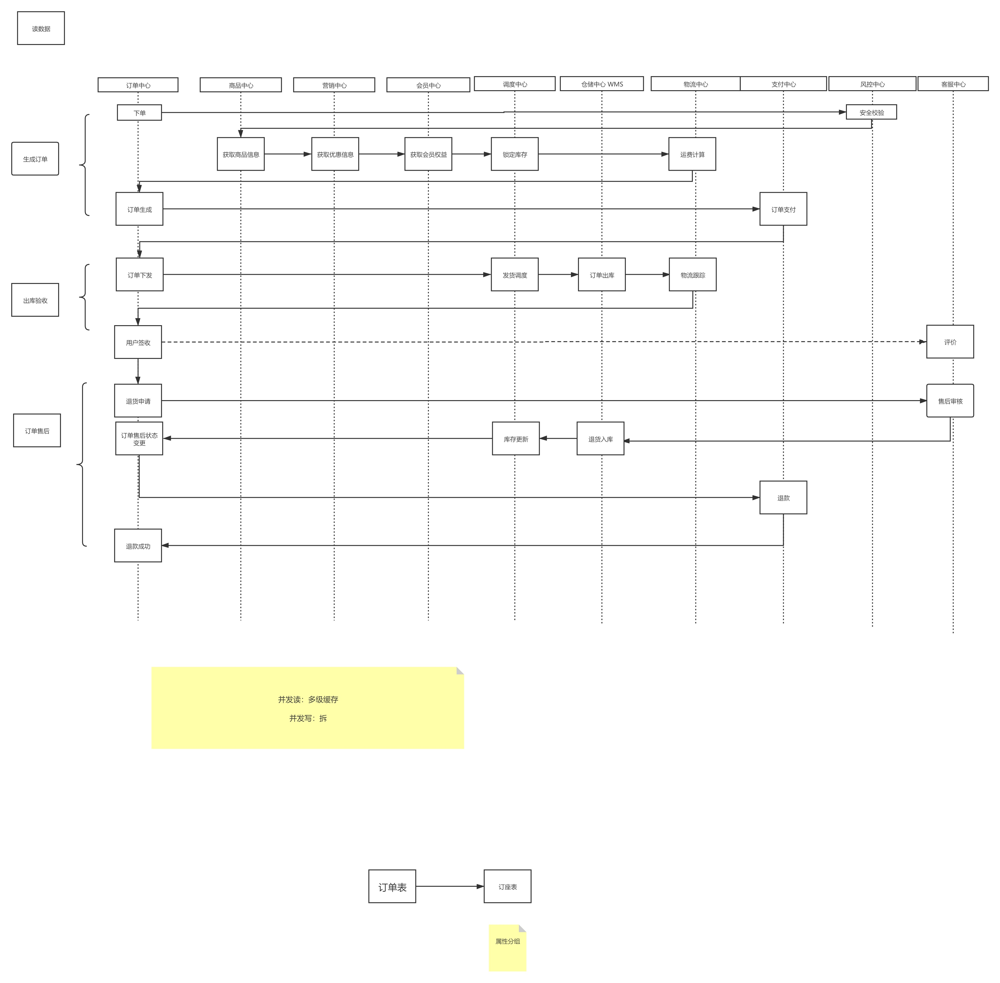

## 安全

### 通道安全

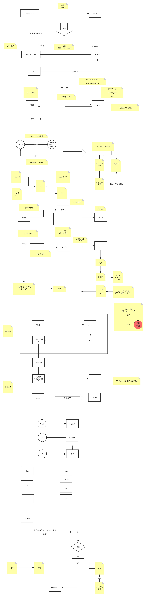


很容易想到加密。用对称加密算法加密解密，这就类似于我们的压缩和解压缩，客户端使用密钥进行加密，服务器用密钥进行解密。

但是问题就是密钥是如何同步的？如果就是简单的直接通过请求获取这个密钥，那么坏人如果也去请求这个密钥，那么还是不安全的。

既然在网络中传输不安全，那么我干脆就不传输密钥了，也就是说我们不使用对称加密了，我们使用非对称加密。这样大家都拿着一样的公钥，坏人使用公钥没有办法解密，只有在服务器独一份的私钥才能够解密。这时候浏览器就直接将参数直接用公钥加密，放心的直接发送出去，服务器会用独有的私钥解密。

涉及到两次非对称加密。请求的时候一次，响应的时候一次。请求的时候是公钥加密私钥解密。响应的时候是私钥加密，公钥解密。

非对称加密的缺点：计算量大。

- 对称加密的效率高但是不安全。非对称加密安全但是效率低。能不能融合一下？变成一次非对称加密，一次对称加密？

是可以的，前面我们提到了，对称加密的问题是对称密钥的传输怕坏人截获，那么我们就把密钥的传输过程使用非对称加密算法进行加密。然后后续的响应就使用对称加密。这样从两次的非对称加密变为了一次非对称加密。

但是这样依然有问题。会有中间人攻击问题。我们知道公钥是任何人可以获取的。那么A要和B使用非对称加密进行通信的时候需要先向B获取公钥。但是这个时候A的请求被攻击者拦截了，攻击者给A发送了它的公钥。然后攻击者向B请求了公钥。这样攻击者就分别建立了A和B之间的联系。这样A发送的请求就可以被攻击者的A的私钥解开，然后B的响应也可以被A的公钥解开，这样一来以后A和B使用对称加密，这个对称加密的密钥早就被攻击者知道了。

```
中间人攻击（Man-in-the-Middle Attack，简称MITM攻击）是一种网络安全攻击，其中攻击者插入自己在通信双方之间，欺骗它们并窃取或篡改通信数据。

在中间人攻击中，攻击者可以截获双方之间的通信，并对通信内容进行监听、修改或伪造，而双方可能对此毫无察觉。攻击者通常会在双方之间建立两个独立的连接，并将自己伪装成通信双方的一方，使得双方认为他们正在直接进行通信。

以下是中间人攻击的一般工作流程：

攻击者在受害者A和目标B之间插入自己，形成A-攻击者-B的连接。

A认为它正在与B直接通信，而攻击者伪装成B并向A发送伪造的证书或公钥，使A相信它正在与真正的B进行通信。

攻击者同样向B发送伪造的证书或公钥，使B相信它正在与真正的A进行通信。

A和B都与攻击者建立了独立的连接，攻击者可以监视、修改或篡改他们之间的通信数据，而A和B之间的通信内容被攻击者完全掌握。

中间人攻击可能发生在各种通信协议中，包括但不限于网页浏览器和服务器之间的HTTPS通信、电子邮件传输、VoIP通话等。

为了防止中间人攻击，常用的安全措施包括使用加密通信协议（如TLS/SSL）、使用数字证书验证双方身份、在通信过程中进行完整性检查等。这些措施可以确保通信的机密性、完整性和身份认证，从而减少中间人攻击的风险。
```

上面问题关键就在于攻击者可以伪造服务器，类比现实中的例子，如何辨别一个人是不是真的那个人？给我你的身份证！也就是服务器需要有证书，我才相信你给的公钥。

- 首先有一个大家公认的机构CA。把你的域名和公钥给它，它会帮你生成一个证书。

  ```
  数字证书中包含了一些重要的信息，其中最常见的信息包括：
  主题（Subject）：证书的主题字段包含了与证书相关的实体信息，通常是服务器的域名或个人/组织的名称。
  颁发者（Issuer）：证书的颁发者字段指示了证书颁发机构（CA）的名称。
  有效期（Validity）：证书的有效期字段标识了证书的生效日期和过期日期。在这个时间范围内，证书可以被认为是有效的。
  公钥（Public Key）：证书中包含了服务器的公钥。这是用于加密通信中密钥交换和数据加密的关键。
  数字签名（Digital Signature）：证书中的数字签名是由证书颁发机构使用其私钥对证书的一部分数据进行加密生成的。用于验证证书的完整性和真实性。
  主题备用名称（Subject Alternative Name）：这个字段包含了与证书关联的其他域名或IP地址，可以包含主要域名和其他可接受的域名。
  密钥用途（Key Usage）：这个字段标识了证书中的公钥的使用方式，例如加密、数字签名等。
  扩展字段（Extensions）：证书的扩展字段包含了一些额外的信息，如可信任的证书颁发机构列表、域名约束等。
  ```

- 数字签名为证书中的内容先经过一个Hash运算，然后CA使用它独有的私钥对其进行签名。

  ```
  为什么签名不能直接使用Hash就行了呢？Hash运算不够安全吗
  是为了防止坏人伪造一个证书。拿私钥进行签名之后浏览器只认它内置的那些机构。浏览器只内置了有限的几个机构的公钥。
  
  ```

  所以说公司也可以自治一个证书。只要你的私钥没暴露出去，那么就是安全的。只要你通过某种途径让访问你的客户端来获取到你的公钥就好了，比如说。他第一次打开你的网站的时候，你给他提供一个下载链接，让他把你的证书下载到他本地，安装到他操作系统的证书里面就OK了

- 服务器把证书发给浏览器，浏览器首先验证证书的完整性以及合法性，首先使用公钥对签名进行解密，然后使用相同的Hash对证书的内容进行验证，验证算出来的散列一不一样。如果内容一样，那么说明证书没有被修改过，那么浏览器就开始对验证里面的内容进行验证，验证发过来的证书的域名和我访问的服务器的域名是否一样，你的证书是否还在有效期等等，如果验证通过，那么说明这个服务器就是那个对的，可以使用证书里面的公钥进行加密。

- 拿到了公钥之后，浏览器就可以使用这个公钥给服务器发送请求了，浏览器随机生成一个对称加密的密钥，使用公钥加密，然后发送给浏览器。之后的请求就是都使用对称加密算法进行了。

```
浏览器通过以下步骤来验证证书签名的有效性：
获取根证书：浏览器内置了一组根证书（Root Certificate），这些根证书由可信任的证书颁发机构（CA）发布。这些根证书的公钥用于验证其他证书的签名。
验证证书链：浏览器从服务器接收到的证书中提取出证书链，包括服务器证书和中间证书颁发机构的证书（如果有）。浏览器会按照一定顺序依次验证证书链中的每个证书。
验证签名：浏览器使用根证书中的公钥对证书链中的每个证书的签名进行验证。这个过程涉及到使用证书颁发机构的公钥解密证书中的数字签名，并通过比较解密后的签名与证书内容的哈希值是否匹配来验证签名的有效性。
验证链中的每个证书：浏览器会验证证书链中的每个证书的有效性，包括检查证书是否过期、是否被吊销，以及与域名是否匹配等。这些验证步骤确保证书的完整性和合法性。
验证根证书的可信任性：最后，浏览器会验证根证书的可信任性。如果证书链中的最后一个证书是由浏览器内置的根证书签发的，并且通过了前面的验证步骤，浏览器将认为证书签名有效。
如果证书链中的每个证书都通过了验证，并且根证书被认为是可信任的，浏览器将确定证书签名是有效的，即证书的签发者确实是受信任的证书颁发机构，并且证书的内容没有被篡改。根据这个验证结果，浏览器可以建立安全的HTTPS连接，并信任服务器的证书。
```

```
浏览器验证数字证书的真伪通常遵循以下流程：
获取证书：浏览器通过HTTPS与服务器建立连接，并由服务器将数字证书发送给浏览器。证书通常作为服务器响应中的一部分发送给浏览器。
验证证书链：浏览器首先会验证证书链的有效性。证书链是由一系列证书组成的，从服务器的证书一直到根证书（Root Certificate）。浏览器会检查证书链中每个证书的签名是否有效，以及证书是否过期或被吊销。此外，浏览器还会检查服务器证书链中是否包含中间证书颁发机构的证书，并验证这些中间证书的有效性。
验证域名匹配：浏览器验证服务器证书中包含的域名与用户访问的域名是否匹配。这是为了防止恶意服务器使用伪造的证书来欺骗用户。浏览器会检查证书中的通用名称（Common Name）或主题备用名称（Subject Alternative Name）字段，确保其中包含了用户访问的域名或其相关子域名。
检查证书有效期：浏览器检查服务器证书的有效期是否在当前时间范围内。如果证书已过期，浏览器将视其为不受信任的。
检查证书吊销状态：浏览器会检查证书吊销列表（Certificate Revocation List，CRL）或在线证书状态协议（Online Certificate Status Protocol，OCSP）来确认证书的状态。这可以防止使用已被吊销的证书进行欺骗或滥用。
验证根证书的信任：浏览器会使用内置的信任根证书库来验证证书链中根证书的真实性和可信任性。根证书是由受信任的证书颁发机构发布的，浏览器内置了这些根证书的公钥。
发出警告或错误：如果证书验证过程中发现任何问题，如无效的签名、域名不匹配、证书过期或吊销等，浏览器将向用户显示警告或错误信息，提示可能存在安全风险，并让用户决定是否继续与该服务器建立连接。
通过这个验证流程，浏览器可以判断服务器的证书是否有效、真实且受信任。如果证书验证成功，浏览器将使用证书中包含的公钥进行后续的密钥交换和通信加密，确保安全的HTTPS连接。
```


#### 实战

服务器需要有：公钥、私钥

客户端需要有：CA的公钥


keystore：存储钥对（公钥私钥）以及证书（私钥）。

keystore 在jdk里面有

```
C:\Users\86187>keytool
密钥和证书管理工具

命令:

 -certreq            生成证书请求
 -changealias        更改条目的别名
 -delete             删除条目
 -exportcert         导出证书
 -genkeypair         生成密钥对
 -genseckey          生成密钥
 -gencert            根据证书请求生成证书
 -importcert         导入证书或证书链
 -importpass         导入口令
 -importkeystore     从其他密钥库导入一个或所有条目
 -keypasswd          更改条目的密钥口令
 -list               列出密钥库中的条目
 -printcert          打印证书内容
 -printcertreq       打印证书请求的内容
 -printcrl           打印 CRL 文件的内容
 -storepasswd        更改密钥库的存储口令
 -showinfo           显示安全相关信息
```


生成keystore

注意：域名要写上去

```sh
C:\Users\86187>keytool -genkeypair -alias dongbao-alias -keypass 123456 -keyalg RSA -keysize 1024 -validity 365 -keystore D:\Notes\DongBao\wcx-dongbao-mall-parent\wcx-dongbao-application\wcx-dongbao-portal-web\src\main\resources\dongbao-alias.keystore -storepass 123456 -ext san=dns:localhost
```

查看keystore

```sh
PS D:\Java\jdk1.8.0_131\bin> .\keytool.exe -list -v -keystore E:\cer2\dongbao-alias.keystore
输入密钥库口令:

密钥库类型: JKS
密钥库提供方: SUN

您的密钥库包含 1 个条目

别名: dongbao-alias
创建日期: 2021-5-14
条目类型: PrivateKeyEntry
证书链长度: 1
证书[1]:
所有者: CN=chao, OU=msb, O=msb, L=bj, ST=bj, C=cn
发布者: CN=chao, OU=msb, O=msb, L=bj, ST=bj, C=cn
序列号: be4b676
有效期开始日期: Fri May 14 20:17:28 CST 2021, 截止日期: Sat May 14 20:17:28 CST 2022
证书指纹:
         MD5: FE:6C:2B:E6:10:AF:4E:65:E6:23:31:2C:0E:7E:B5:65
         SHA1: 02:69:99:B8:FB:7A:84:FD:53:88:60:60:24:9F:91:9D:9A:0B:35:E4
         SHA256: ED:DF:DE:9E:15:EA:CB:68:76:94:FE:C1:C9:B2:89:93:51:FA:E8:5C:9E:9D:B6:03:05:79:87:DD:E0:89:EB:82
         签名算法名称: SHA256withRSA
         版本: 3

扩展:

#1: ObjectId: 2.5.29.14 Criticality=false
SubjectKeyIdentifier [
KeyIdentifier [
0000: B4 B9 C3 B6 5A B8 4E 15   AA CB D3 4D 17 8C E1 38  ....Z.N....M...8
0010: 35 3D B5 94                                        5=..
]
]


*******************************************
*******************************************


PS D:\Java\jdk1.8.0_131\bin> .\keytool.exe -list -rfc -keystore E:\cer2\dongbao-alias.keystore
输入密钥库口令:

密钥库类型: JKS
密钥库提供方: SUN

您的密钥库包含 1 个条目

别名: dongbao-alias
创建日期: 2021-5-14
条目类型: PrivateKeyEntry
证书链长度: 1
证书[1]:
-----BEGIN CERTIFICATE-----
MIICPjCCAaegAwIBAgIEC+S2djANBgkqhkiG9w0BAQsFADBSMQswCQYDVQQGEwJj
bjELMAkGA1UECBMCYmoxCzAJBgNVBAcTAmJqMQwwCgYDVQQKEwNtc2IxDDAKBgNV
BAsTA21zYjENMAsGA1UEAxMEY2hhbzAeFw0yMTA1MTQxMjE3MjhaFw0yMjA1MTQx
MjE3MjhaMFIxCzAJBgNVBAYTAmNuMQswCQYDVQQIEwJiajELMAkGA1UEBxMCYmox
DDAKBgNVBAoTA21zYjEMMAoGA1UECxMDbXNiMQ0wCwYDVQQDEwRjaGFvMIGfMA0G
CSqGSIb3DQEBAQUAA4GNADCBiQKBgQDEXr8P0dlvpZRhcKSkKgfzSRA3TpH8RfZc
7b529PeiaRQGm7cXlath5w0Nj1gs6jZWSzltcf7SIdMEkpxTX4/xbXt8v/87L7Dd
icGOt4+VVh6NOrqB9HhNqeEtGRMv+DAHg6zij3uA+YCNA40Oretojjf4v51QSsvf
Qv6W4DWhTQIDAQABoyEwHzAdBgNVHQ4EFgQUtLnDtlq4ThWqy9NNF4zhODU9tZQw
DQYJKoZIhvcNAQELBQADgYEAO44gcNl5M2J8aYovmV+yh48gvF3JXjE0UudfHony
/3Gy36HIvJxADrKcTZ+6ScCg9w/BzJdYaQyHYvALG/ICMc4EMQhwPsiDu4VGLQqF
HxWSY0Is5gBSIV+WHa+KxgQ5j05qeIOIxt5peBJg/+ShuAdyn2e0OIwzaUq6fcqh
698=
-----END CERTIFICATE-----


*******************************************
*******************************************


PS D:\Java\jdk1.8.0_131\bin>
```

代码验证过了。公私钥对没问题。


CA的公钥

客户端导出证书

```sh
keytool -exportcert -alias dongbao-alias -keystore D:\Notes\DongBao\wcx-dongbao-mall-parent\wcx-dongbao-application\wcx-dongbao-portal-web\src\main\resources\dongbao-alias.keystore -file D:\Notes\DongBao\wcx-dongbao-mall-parent\wcx-dongbao-application\wcx-dongbao-portal-web\src\main\resources\my.cer
输入密钥库口令:
存储在文件 <e:\cer2\my.cer> 中的证书
PS D:\Java\jdk1.8.0_131\bin>
```

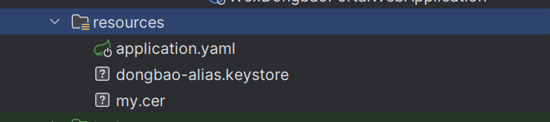

打开-》安装一下

| 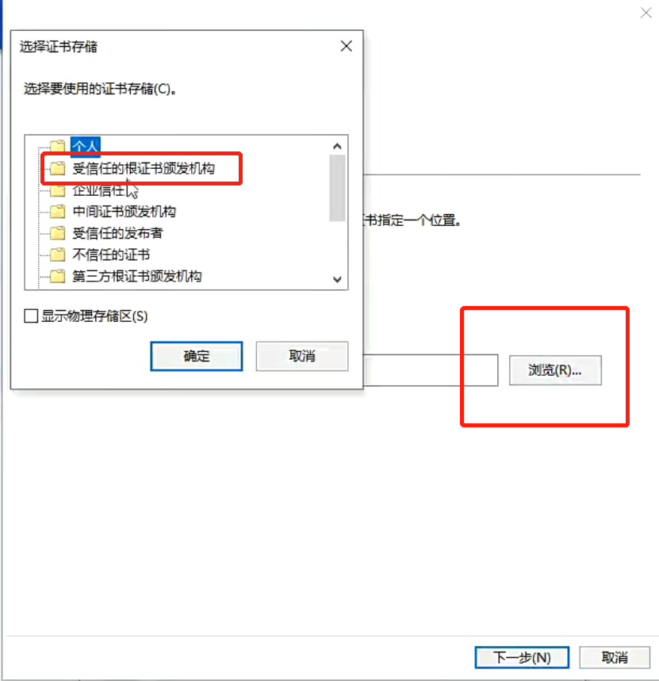 |      |
| ------------------------------------------------------------ | ---- |
| 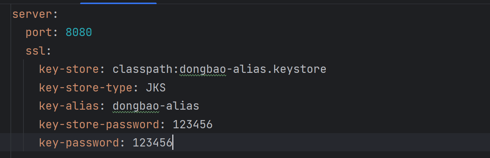 |      |
|                                                              |      |
|                                                              |      |

这时候去访问的时候地址需要输入https协议。http暂时不能用了。

证书是我们手动导入了。我们可以做成别人一访问就让它下载一些东西，下载的就是你的证书。

- 没有装证书，也可以访问，但是浏览器上面提示的就是不安全的。

你多出一个域名就要多发一个证书！

但是用户访问不会自带https怎么办？我们后端可以写一个转发，转发到https，但是这样我们程序员测试接口也很麻烦！所以一般实际中https都是做到nginx上，而不直接设置到后端。把流量全部都发到nginx，然后后端的接口全部不对外，通过内网访问。在nginx做一个https。

- https默认端口443

- 先在电脑上装openssl。设置环境变量

- 到指定的目录下执行下面命令

- ```
  D:\Notes\DongBao\nginx>openssl genrsa -des3 -out dongbao.key 1024
  D:\Notes\DongBao\nginx>openssl req -new -key dongbao.key -out dongbao.csr.src
  D:\Notes\DongBao\nginx>openssl rsa -in .\dongbao.key.src -out dongbao.key
  D:\Notes\DongBao\nginx>openssl x509 -req -days 365 -in .\dongbao.csr -signkey .\dongbao.key -out dongbao.crt
  ```

- 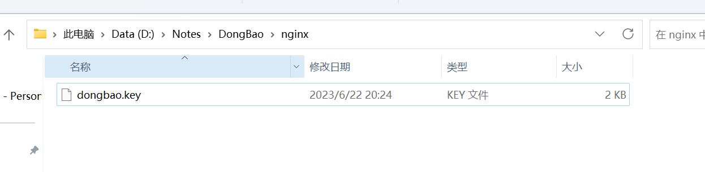

- 在实际的项目中，这些文件都是你去买的。因为给每一个用户都装上自己的证书也太low了。

  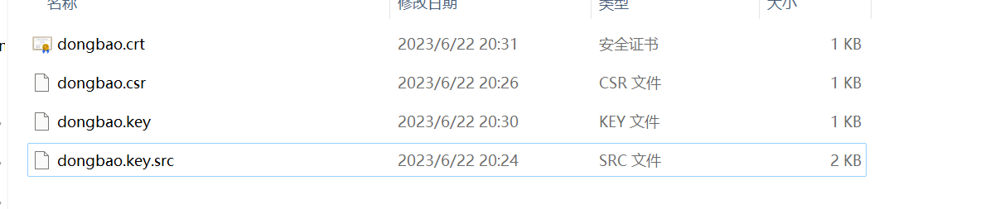

nginx的配置：

```
#user  nobody;
worker_processes  1;

#error_log  logs/error.log;
#error_log  logs/error.log  notice;
#error_log  logs/error.log  info;

#pid        logs/nginx.pid;


events {
    worker_connections  1024;
}


http {
    include       mime.types;
    default_type  application/octet-stream;

    #log_format  main  '$remote_addr - $remote_user [$time_local] "$request" '
    #                  '$status $body_bytes_sent "$http_referer" '
    #                  '"$http_user_agent" "$http_x_forwarded_for"';

    #access_log  logs/access.log  main;

    sendfile        on;
    #tcp_nopush     on;

    #keepalive_timeout  0;
    keepalive_timeout  65;

    #gzip  on;

    server {
        listen       80;
        server_name  localhost;

        #charset koi8-r;

        #access_log  logs/host.access.log  main;

        location / {
            root   html;
            index  index.html index.htm;
        }

        #error_page  404              /404.html;

        # redirect server error pages to the static page /50x.html
        #
        error_page   500 502 503 504  /50x.html;
        location = /50x.html {
            root   html;
        }

        # proxy the PHP scripts to Apache listening on 127.0.0.1:80
        #
        #location ~ \.php$ {
        #    proxy_pass   http://127.0.0.1;
        #}

        # pass the PHP scripts to FastCGI server listening on 127.0.0.1:9000
        #
        #location ~ \.php$ {
        #    root           html;
        #    fastcgi_pass   127.0.0.1:9000;
        #    fastcgi_index  index.php;
        #    fastcgi_param  SCRIPT_FILENAME  /scripts$fastcgi_script_name;
        #    include        fastcgi_params;
        #}

        # deny access to .htaccess files, if Apache's document root
        # concurs with nginx's one
        #
        #location ~ /\.ht {
        #    deny  all;
        #}
    }


    # another virtual host using mix of IP-, name-, and port-based configuration
    #
    #server {
    #    listen       8000;
    #    listen       somename:8080;
    #    server_name  somename  alias  another.alias;

    #    location / {
    #        root   html;
    #        index  index.html index.htm;
    #    }
    #}
	
	
	upstream com.cpf {
		server 127.0.0.1:8080; # 需要监听的端口名 我用的
		keepalive 64;
	}

    # HTTPS server
    #
    server {
        listen       443 ssl;
        server_name  cpf.com;
		

        ssl_certificate      dongbao.crt;
        ssl_certificate_key  dongbao.key;
		

        ssl_session_cache    shared:SSL:1m;
        ssl_session_timeout  5m;

        ssl_ciphers  HIGH:!aNULL:!MD5;
        ssl_prefer_server_ciphers  on;

        location / {
            proxy_pass http://com.cpf;
        }
    }
}
```

### 数据安全

参数防篡改。

```
http-超文本传输协议：

超文本：包括：文字，图片，音频，视频等。

传输：客户端向服务端发东西，服务端向客户端发东西。

协议：三方协议。怎么传，错误处理。责权利。

总结：在计算机世界中：两点（客户端，服务端）直接传输 超文本的一个约定 、 规范。应用层协议。
```

#### 设计好的接口

怎么办？看别人优秀的设计，借鉴。

标准：文档给对方，对方无需找你确认。站在对方的角度，看你的输出。


#### restful

资源：超文本 delete /order

表现层：json，xml,二进制，avi。表现层一般都是json

状态转移：修改数据


#### URL如何设计

利用http的动作post、get来代替原有的动作。也就是尽量不要设计成/add/order或者/addOrder。

xxxxx/子功能/v1/,版本号。


里面用什么词？名词。动词。

/add/order  /addOrder

/update/order


/order post,put,patch

方法：get post


新增订单： post  /order

修改订单：put /order


#### 动作

get  查询：单条记录，列表。

post: 新建资源。（新增订单）

put: 更新（全量更新）

patch: 更新（局部更新，10,1）

delete:删除。


```json
应用添加
path:/app
method:post
请求参数：
{
	"enAppName":"英文应用名称",
	"chAppName":"中文应用名称",
	"operator":"操作人",
	"dataSourceType":"1",
	
}
返回参数：
{
	"code":0,
	"message":"消息内容"，
	"data":{}
}

应用修改
path:/app
method:put
请求参数：
{
	"appId":"uuid",//新增不填，修改必填
	"enAppName":"英文应用名称",
	"chAppName":"中文应用名称",
	"operator":"操作人"
	
}
返回参数：
{
	"code":0,
	"message":"消息内容"，
	"data":{}
}

应用修改(局部)
path:/app/{appId}
method:patch
请求参数：
{
	"chAppName":"中文应用名称",
}
返回参数：
{
	"code":0,
	"message":"消息内容"，
	"data":{}
}

应用删除
path:/app/{appId}
method:delete
请求参数：
无
返回参数：
{
	"code":0,
	"message":"消息内容"，
	"data":{}
}

应用列表
path:/app/list?pageNumber=1&pageSize=10&queryStr=查询条件&sortrule=+a字段,-b字段
method:get

返回参数：
{
	"code":0,
	"message":"消息内容"，
	"data":{
		"list":[
			{
				"appId":"uuid",
				"enAppName":"英文应用名称",
				"chAppName":"中文应用名称",
				"dataSourceType":"1",
				"operator":"操作人",
				
				"createTime":毫秒长整型,
				"updateTime":毫秒长整型
			},
			{
				"appId":"uuid",
				"enAppName":"英文应用名称",
				"chAppName":"中文应用名称",
				"dataSourceType":"1",
				"operator":"操作人",
				
				"createTime":毫秒长整型,
				"updateTime":毫秒长整型				
			}
		],
		"pageNumber":1,//第几页，从1开始。
		"pageSize":10,//页面大小	
		"totalRecord":100,//总数
	}
}

应用详情
path:/app/{appId}
method:get

返回参数：
{
	"code":0,
	"message":"消息内容"，
	"data":{
				"appId":"uuid",
				"enAppName":"英文应用名称",
				"chAppName":"中文应用名称",
				"dataSourceType":"1",
				"operator":"操作人",
				"createTime":毫秒长整型,
				"upateTime":毫秒长整型
		}
}
```


/order/delete

xxxdao.delete(id)


get 1024kb    post

看公司的规范，越规范的，对接口的设计就越详细。不要惧怕写文档。


#### 防篡改

- 情景：首先写的接口是公司内部用。当你的公司发展到一定规模，或者说你的用户量很大的时候。你这个接口可能其他公司会用。然后有其他的公司要来接我们的订单服务就是说，他要通过他的平台来给你派单。那么你就要给它提供一个接口。

api（接口）  公司用。

其他公司会用。

- 这样的话，你需要在你的借口中把appId、appKey预留出来

这俩参数：

appId(阿里的飞猪，xx部门，下应用id),     appKey(appSecret)（网络中不传输。），默认值就是你当前公司的就ok了。

提供方将这两个参数  下发给 使用方。


思路：

用户参数，用户的签名。----联想到https的证书，怎么知道它有没有被修改，就是利用了签名。

加上appSecret也就是盐。

sign1=Md5/sha256(age=10name=张三appSecret=xxx)


传给后端：name=李四&age=10&sign=xxxxxxx，

sign2=Md5/sha256(age=10name=李四appSecret=xxx)


学：解决方案，就别和业务耦合。

#### 防止重复请求

加时间戳（不能从根源上避免）

请求做一个md5放入redis可以防止重复请求，可能会误杀，但是概率低。


#### get和post的区别

get和post在底层来说，就是从HTTP协议的角度来说，他们没有任何区别，只是报文格式不同，也就是发请求的时候方法不一样而已。一个是get方法一个是post方法。

长度其实是由浏览器决定的，其实http协议本身没有长度的限制。

参数位置一样。get?a=b&dd=d 可以放body的。   post body也可以放url中。参数位置可以一样。

只要是http，都不安全。


http底层基于tcp和ip，可靠的。tcp、ip可以认为是高速公路，上面跑的是汽车。公路上肯定不会限制你运输多少货，从A地到B地，A决定发多少参数，也就是由浏览器决定的。

汽车在高速路上。get  post

运输公司 限制了参数长度的请求。

/asdfa/asdfasdf?asdfa=asdf&a=b     md5值=  redis中  , 无法保证 不误杀。（两次不同的请求是一样的摘要）

header里 ：key value


#### 写到filter里面

写一个工具类获取请求中的参数以及body的参数，然后去验证。

1. 获取url上的参数
2. 获取body上的参数

一般来说get就只放到url上。post就只放到body上。很少有都放的，但是都放也是合法的，所有的方法PUT,GET,PATCH,POST等等在实际使用中没有什么区别。

body的流会被吸走，复制一份。自己写CachedBodyHttpServletRequest，本质就是自己实现了获取输入流的方法。自己继承HttpServletRequestWrapper包装类，其实是一个装饰者模式。


## 商品系统

### 注意

- 设计实现业务：先确保简单可用！由简单到复杂。
- 不要一次实现所有需求
- 技术债务要还
- 提交到git之前一定要保证你的代码是流程畅通的。

### 引入

京东，淘宝 spu和sku的 重视度不同？

淘宝减少 存储空间。多个sku共享一个详情页。

京东重视sku，更精细化一些，用户体验好。便于物流管理。


淘宝的商品量级：亿级，ioe。ibm，Oracle，emc存储

京东：百万级。


商品中心两部分：买家：多样化展示；管理端（卖家）：方便管理，或者流转。


### 基本概念

SKU：Stock Keeping Unit: 库存保存单元。库存控制的最小可用单位。iphone12 plus 128g。它有多少个，库存。

SPU: Standard  Product  Unit：标准化产品单元。iphone12  （品牌苹果）+ IOS操作系统 + xxx显示屏  。


spu是sku的大集，sku会更加具体，例如具体到iphone12  是64G的还是128G的。


sku  能对应 几个 spu？（多对一）

一条白色花边xxxx修饰裤子=sku，对应2个spu：1. 七分裤夏季薄款运动休闲，2.男士大码小脚潮。xxx更多的。

买家也得关心sku。

前面的sku是让买家管理的，后面的spu其实更重视用户的搜索。


sku3其实不存在，依托于sku1和sku2。

| 商品          | 订单数量 | sku  | 组合sku              | 仓库发货sku     |
| ------------- | -------- | ---- | -------------------- | --------------- |
| 确定的桌子    | 1        | sku1 |                      | 1*sku1          |
| 确定的凳子    | 1        | sku2 |                      | 1*sku2          |
| 一套饭桌 套餐 | 1        | sku3 | 1*sku1 + 4*sku2（1） | 1*sku1 + 4*sku2 |

合单和拆单。

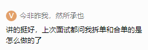


### 类目

大型电商系统是拆分开的。

商品还是那个商品，但是你得随着季节或者销售策略，或者说有活动的改变来调整它归属为哪一个类

#### 后台类目

基础数据：让系统看的。sku必须绑定 后台类目。后台类目差不多固定。

层次不要太深：三层。最多4层。对技术和管理都是好的。

叶子类目：商品必须挂在叶子类目下。

| 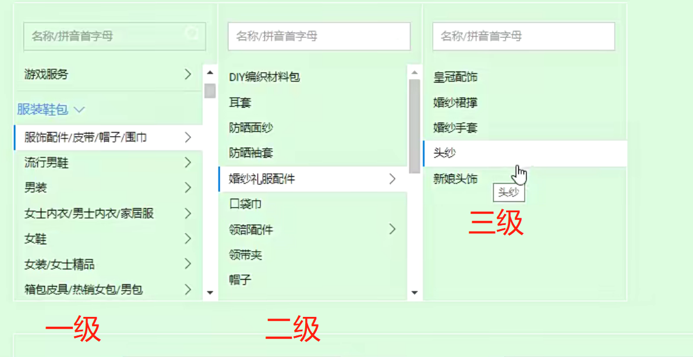 |      |      |
| ------------------------------------------------------------ | ---- | ---- |


#### 前台类目

让消费者看的。便于用户查看和搜索的。

pc，h5，app端，展示的类目是不一样的，例如屏幕大小可能不一样。（所以数据库设计需要客户端来源）


确定映射关系：1:1, 1:n, m:n。


头纱/公主风


饰品/白色


多对多2天，1对1：半天。


在后台中：礼服配饰、皮带、帽子、围巾肯定都是单独的类目，但是在前台类目中我们可以四个一起展示。所以后台类目：前台类目=1:n。

- 最好全部做成多对多，免得以后需要修改，给自己添麻烦。叫你做成一对一的，你也写成一对多。以后叫你改也可以偷懒。
- 难在怎么分析出合理的设计！

|  |      |      |
| ------------------------------------------------------------ | ---- | ---- |

#### 类目设计

类目是为了管理商品的，管理商品其实是管理sku。也就是类目是sku所属的分类。

后台类目应该是不经常变的，所以我们需要加一个前台类目来解耦。

**数据结构 +  操作（删除需要删除标记，逻辑删除，排序需要排序字段）**

- 逻辑删除很常见，有时候不一定真的给你删了。

属性。


管理类目（删除，属性和商品），管理商品（添加商品，增删改查）

树形结构。父类目ID。3、4级。

叶子类目。商品只存在于叶子类目。是否叶子节点。

- 一对多，线怎么画？多指向一，一的主键放在多的里面，因为一个多的那一方需要多一个键才能唯一确定。

搜索词对应 前台类目。

- 中间有一个关联表

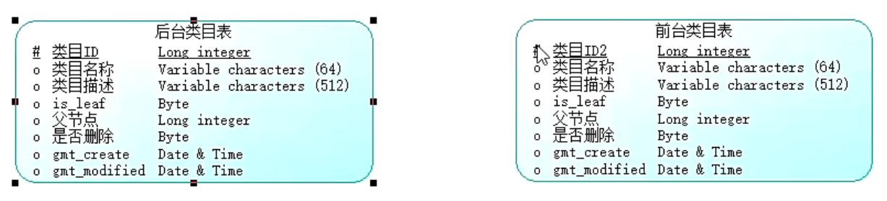

### 品牌

字段：logo，中文名，英文名，产地，xxxxxx，xxxx。

品牌和类目的对应关系：雀巢 ——》咖啡，奶粉，饮料。一个列名也可能有多个品牌，所以也是一个多对多的。

- 属性比较多，比较复杂。

服装->女装：属性A们

通讯->手机：属性B们


- 存图片的url


### 使用powerDesigner创建表

可以把概念模型直接通过这个软件变成物理模型，帮你省去自己创建中间表的步骤。

- 表不要复制，不然不能生成物理模型
- 字段重复报错问题。看下面

| 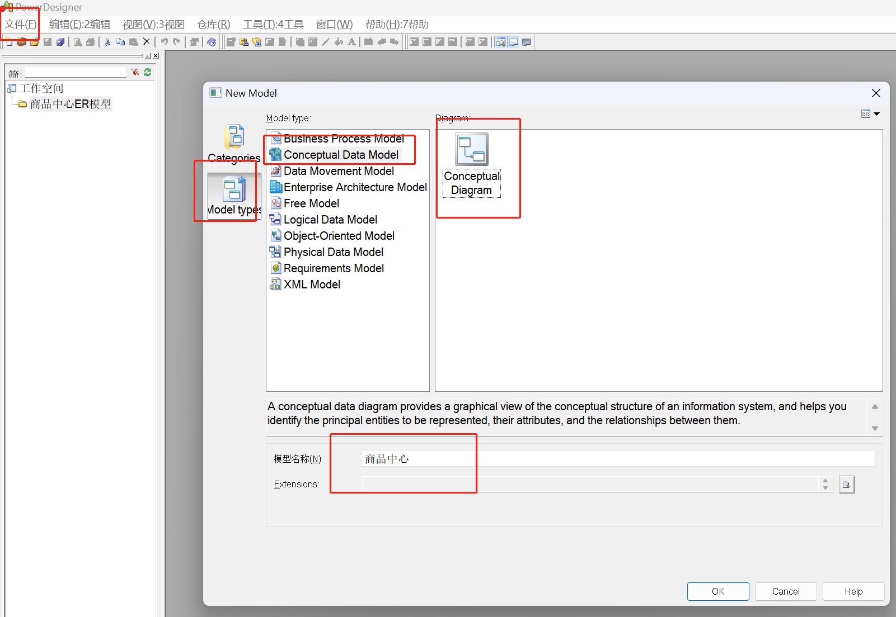 |      |
| ------------------------------------------------------------ | ---- |
| 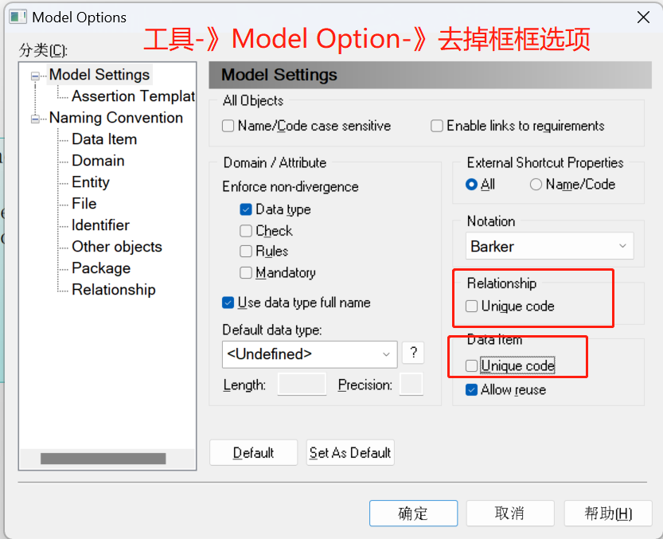 |      |
| 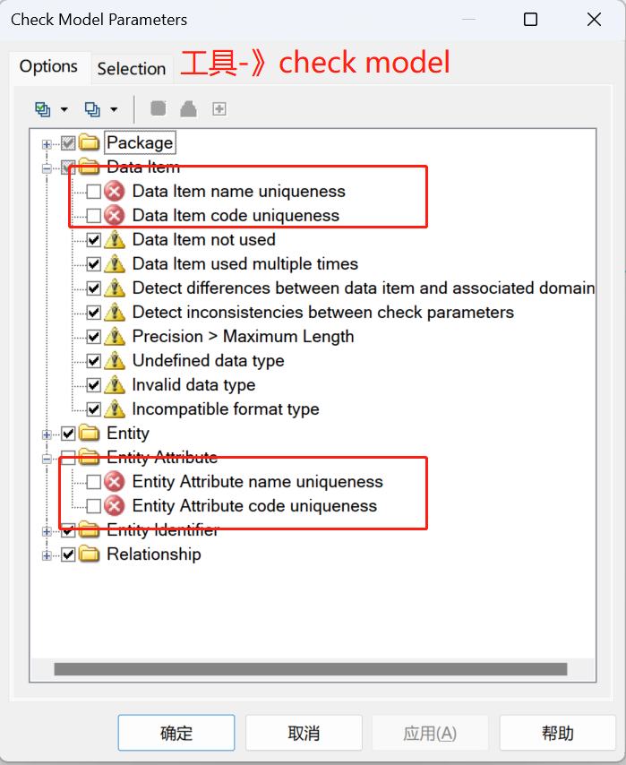 |      |


概念模型创建好了之后点击工具，转化为物理模型，然后才从物理模型变为sql。

- 异构数据源表结构迁移：到navicat里面，把数据库表都导出来（sql）。到pd里面，点击文件，[反向工程]，[database]，选择路径（使用脚本）。这样物理模型就生成了，我们还可以点击[工具]然后变为概念模型。

### 属性

#### 分类

2006年淘宝才引入了属性，最开始只有类目的设计。

属性和类目有关联关系，例如手机这样的产品才会选屏幕尺寸，而衣服是没有屏幕尺寸的。属性属性其实是挂在类目下面的。

属性的分类有下面几个

- 关键属性：确认spu（手机的品牌，型号）。

- 销售属性：确认sku（手机的颜色，内存）。
- 导购属性：手机的新旧程度，保修方式
- 非关键属性：摄像头，USB

最重要的是前两个。


用途：搜索，筛选

#### 使用

属性就是键值对

和类目做关联，归属于类目。	

是否必填

属性类型：单选，多选，自定义。


#### 属性表


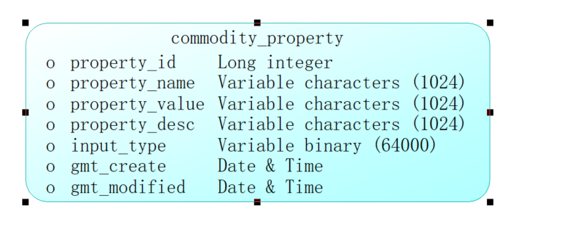


#### 属性分组表

在前端页面展示的时候，不是一条一条展示的，是一栏一栏展示的，所以需要一个属性分组表。

电商做的比较大的时候，叶子类目属性会继承父类目的属性。

分组和类目相关联的。例如手机下面就会有类似手机规格这样的分组。

| 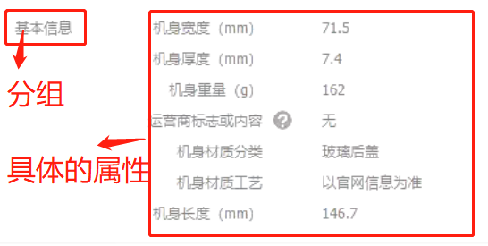 |      |
| ------------------------------------------------------------ | ---- |
| 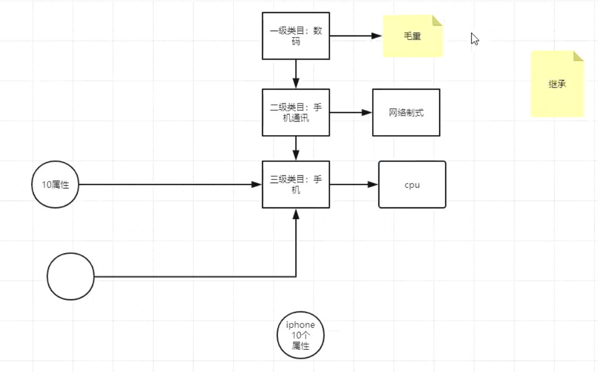 |      |


#### 属性库

专门维护一个属性库，加强可拓展性。

属性是需要管理的，并且不是写死在商品表里面的。

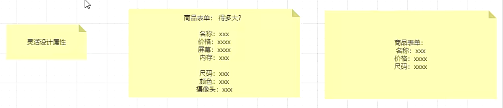


#### 通过属性做什么

通过属性搜出来的一个个商品，其实是一个个的spu，对这个spu选择不同的属性，其实就是确定了商品。

属性和类目，其实本质是一样的。类目也好，属性也好，它都是这个商品的一个属性。

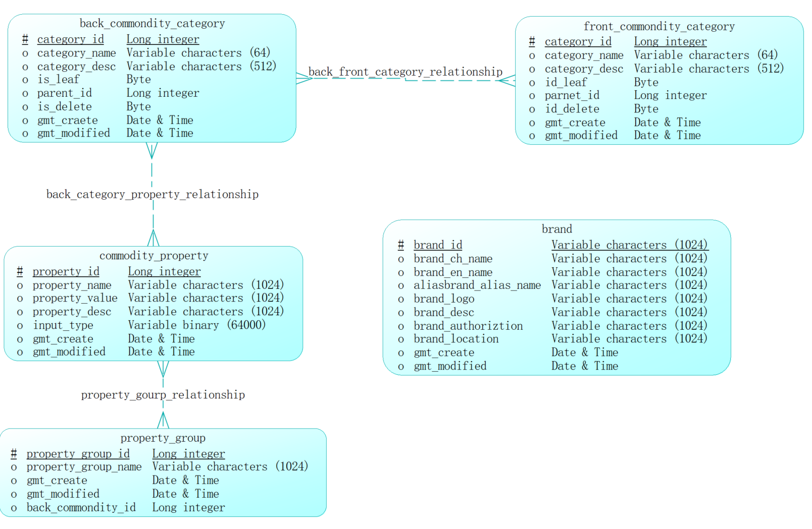


### 商品

小系统可以一张表搞定，但是字段很多，用户量上来的时候，请求挺不住，查询性能会有瓶颈，所以需要把字段进行拆分。


1. 商品基础信息表：公共属性。（长，宽，高，名称）
2. 商品详情表。最开始商品详情只是一个独立字段，但是随着它越来越大，就独立出去了。

3. 商品详情图片表。在商品详情介绍的时候有很多图片

   

4. 商品图片。如果一个某一个功能以后可能做成一个独立的服务，那么就可以提前剥离开。这里商品图片以后可以单独成一个服务，所以提前剥离，因为图片可以放在cdn里面做缓存。

   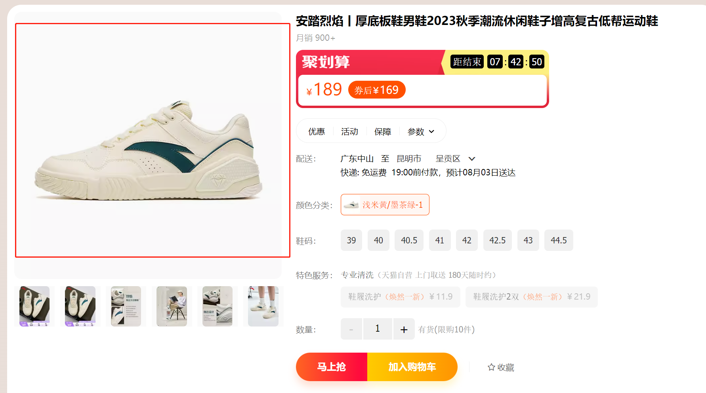

5. 商品sku信息
6. 商品sku属性信息

#### goods--商品基础信息表

商品基础信息表字段设计：

1. goods_id

2. brand_id:一个品牌有多个商品，所以goods表中需要写上品牌的id。

3. sku_code:包装盒上面有的条形码中国是69开头，这是一个全球统一的sku。但是例如猪肉牛肉这种的，没有全球统一的sku所以还有商家自定义的sku。

4. goods_name:主标题

5. goods_sub_name:副标题

6. goods_length

7. goods_width

8. goods_height

9. goods_weight

10. goods_status:代表上下架，售空，预售等等状态。

11. service_guarantees：一件商品是否被品牌方授权

12. package_list:包装里面有什么东西

13. freight_template_id：运费模板

14. gmt_create

15. gmt_modified

    

基础表设计完了之后再去有拓展信息表。

| 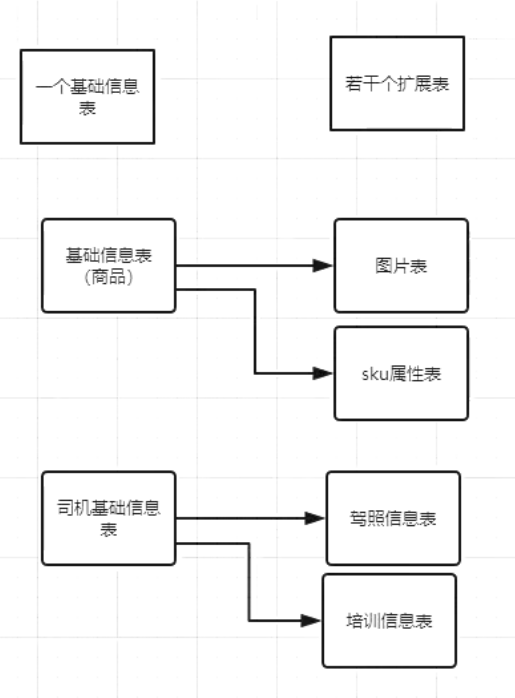 |      |
| ------------------------------------------------------------ | ---- |
|                                                              |      |


#### goods_desc--商品详情表

设计这个基础信息表的扩展表的时候，最好它们的前缀是一样的。

1. goods_desc_id
2. goods_id:和基础信息表的一对一关系
3. goods_desc


#### goods_desc_picture--商品详情图片表

1. goods_desc_picture_id
2. goods_id：一般来说这里应该要是goods_desc_id，但是由于有的商品例如虚拟商品没有详情，并且详情和商品是一对一的关系，所以这里用goods_id来充当一对多关系的外键。
3. sequence：图片的先后顺序
4. goods_picture：一般来说是存url


- 关于图片存储

  1. 放到oss上面（图片存储服务），云存储，给你分配一个图片访问的URL。数据库存储URL。

  2. 数据库中直接存储图片。

     第一种方法优点是不增加存储压力，以及可以将法律风险转给第三方；缺点是URL权限不好控制，例如让指定的用户看到指定的图片。

     第二种方法的缺点是存储空间浪费。


#### 关于属性的一些设计

属性和类目挂载

属性和属性分组归类

属性分组和类目挂载

- 也就是说，类目可以和属性挂载，也可以和属性分组挂载。那么就针对这个挂载 

那么也就是多两个多对多的关联表，并且为了查询方便，冗余了一些字段。


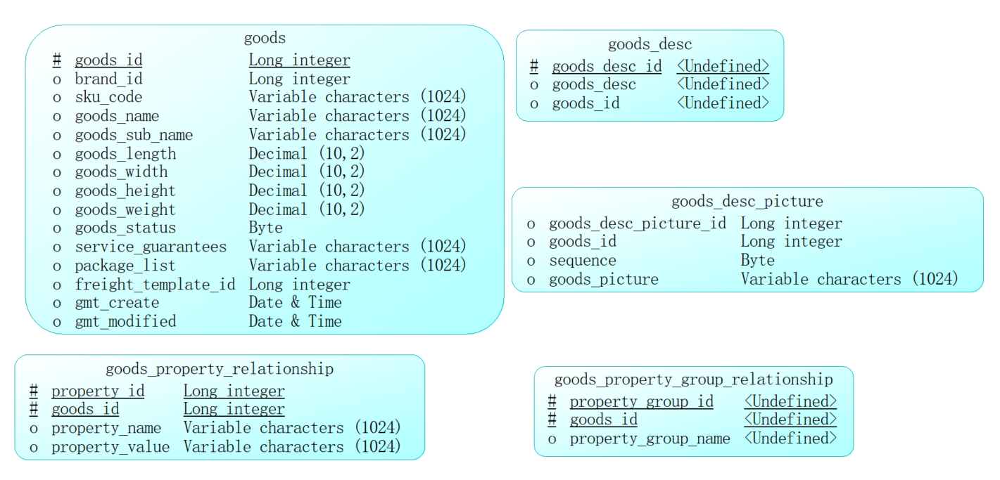


## 促销系统

### 目的

简历增色

1. 拉新（拉来新人）
2. 去库存：让自己的商品更多的卖出去
3. 扩大系统品牌的知名度。
4. 新app上线。

5. 常态，竞争。

6. 提高销量，客单量，客单价。（你用xxx技术，实现了xxx业务，给公司带来了xxxx销量，提高了xxx订单量，提高了xxx客单价）。


长时间周期中，想测试哪个活动策略 最优。----A/B测试（灰度发布，金丝雀发布）。也就是分成两拨人，看到的是不一样的，这样就可以对比活动的对销量的转化率。


10亿用户。1.5亿（在北京  55%做测试），8.5亿（在杭州）。AB如何分类，例如可以按照标签来分类，甚至可以标签中再抽百分比的人出来。

| 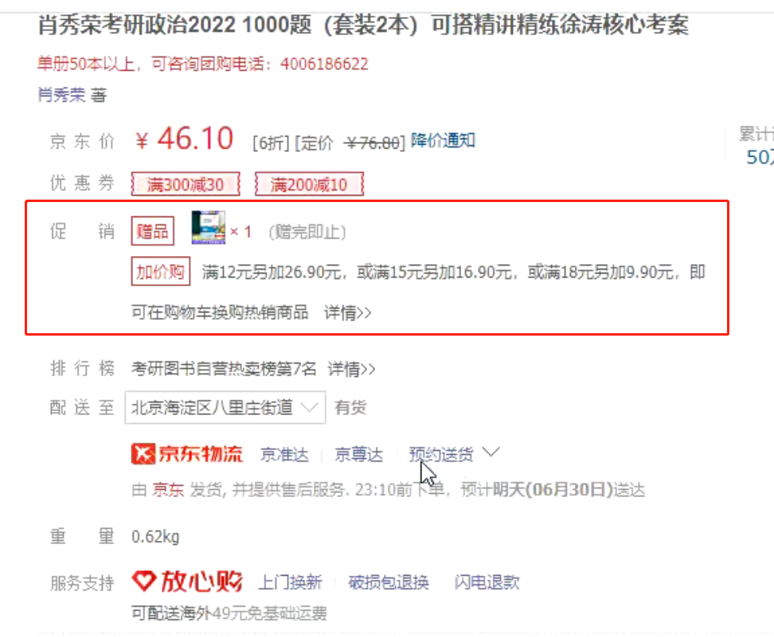 |      |
| ------------------------------------------------------------ | ---- |
|                                                              |      |

### 促销类型

满减促销：

1. 阶梯满减：满100减10，满300减50.
2. 每满减：每满100,减10。等差数列。

单品促销：数量限制，某个商品，打N折。

套装促销：A商品10，B商品10，C商品10，A+B+C=25。

赠品促销：买主商品，送N个赠品。

满赠促销：

1. 满100送东西A，
2. 满100，加10块，送东西B
3. 满100送自拍杆，满200,送充电宝，满500，送手机。


多买优惠促销：

1. M元买N件
2. M件打N折


定金促销：

1. 交100，到时候享受1000元购买2000元东西。

2. 交10块，顶100元。（90元）

   

   

- 促销活动：活动名称：618；活动规则单品促销；时间段（开始时间，结束时间）


### 设计表结构

**当数据量的增加，影响到表结构的时候，说明设计错了。**

这就对了：学生表，当有1名学生，表结构不动，有100个学生，表结构还不动。

我们不能在活动表直接添加类似于full_money/reduce_mony这样的字段，因为这样设计不能满足不同的满减，一个活动可能有200-20和500-100。所以我们需要分表

一个活动可能有多个促销类型，一个促销类型中可能有多种规则。

所以我们需要活动表、促销类型表、规则表

- 活动表搞出来之后需要思考如何作用到商品上--id，类目，属性，价格

#### 活动表

status是表示活动状态：已发布、待审核等等

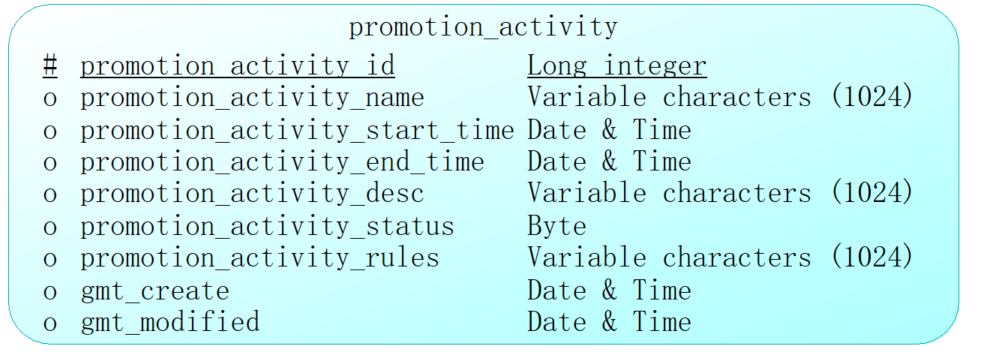

活动的操作：

1. 新建：insert ，审核（活动状态，已发布，未发布），

2. 编辑：（已发布的活动），修改点的对比（新老活动的对比我们要知道）。

   修改活动，存两条记录。修改多次，存多条记录。  所以需要一个活动修改记录表。

   编辑的活动也需要审核。

3. 删除：逻辑删除。（delete_flag=1），除非用户注销。

4. 复制活动：

#### 规则表

规则表不一定需要

- 避免整个系统都是一个活动，2018年的时候京东出过问题。活动设计不好会被薅羊毛
- 活动设计为一个活动对应一个规则比较简单，如果一个活动对应多个规则就太复杂了

方案1：id/full_money/reduce_mony。这种不行，我们的规则有其中，这里只满足了一种。

方案2：每一个规则对应一个表。这样的话规则如果很多，那么会导致频繁修改表。并且需要多一次表的连接，效率低。

我们可以把一个活动细化下来，细化到一个活动对应一个规则。同样都是618活动，但是底层对应的规则可能不一样。

方案3：针对方案2的缺陷，我们可以把规则表示为一个json。但是查询是一个大问题。需要**列式数据库。或者 用 sql行转列。**这样就可以把规则写到活动表中的一个字段了。


### 订单计算

购物车，然后下订单。

如果活动有冲突，那么给用户选择最优原则。


### 优惠券

时间周期，指定商品，特定金额

作用：当钱使用

- 目前是优惠券和活动分开讲。但是活动里面你可以加上优惠券的一些规则，例如这个活动就是使用一个券给你打折。具体可以用json直接把规则放到活动表的字段里面（约定大于配置）。也可以使用关联关系，到几个规则表下面查找是否有关于这个活动的一些记录。

可以做到给一些人卖1w，给一些人卖9k。这是源自于优惠券复杂的计算规则。

- 优惠券和活动不冲突

#### 类型

按照分类的不同标准，可以分为以下几种券。

门槛：现金券（无门槛）、满减券、折扣券

范围：单品券、品类券、品牌券。

发放的主体：平台优惠券（注册、兑换、消费送券）、店铺优惠券

#### 信息

需要的信息：名称，面值，使用条件，使用平台（pc，app端，微信端），有效期（固定有效期，相对有效期（领券之日起 x天有效）），发行量（10万张）

上面的几个信息是平台录入的，用户要使用优惠券，需要有一张用户已领的优惠券表。

现在的问题是优惠券有了，我们怎么和用户建立关系？

其实就是两个实体的一个关系，也就是拥有的关系。

如何实现过期？实时时间段查询：下单的那一刻（校验有效期）

- 设计表的技巧：**角色：分析某个实体，哪个角色影响这个实体，还有就是 实体影响了 哪个角色？**


#### 制券

其实就是往优惠券表里面插信息。


#### 发券

1. 用户主动领。（平台弹出来，领不领是看用户的）
2. 平台主动发：上来你没领，就已经在你的优惠券列表里面了
3. 大客户团购：

需要防止薅羊毛。风控，限制数量。例如平台给a发优惠券。b和a认识，买a的东西，但是不发货。这样就可以白领到平台的补贴。


#### 用券

使用了或者过期了


#### 返还机制

简单粗暴：不还！

退券：（可能涉及到延长时间）


- 插曲

  增加一个类型，A，B，C，D，A忌口：不吃面，B忌口：不吃米。C：不吃xiang

  特别结构化的 数据。不要写死。
